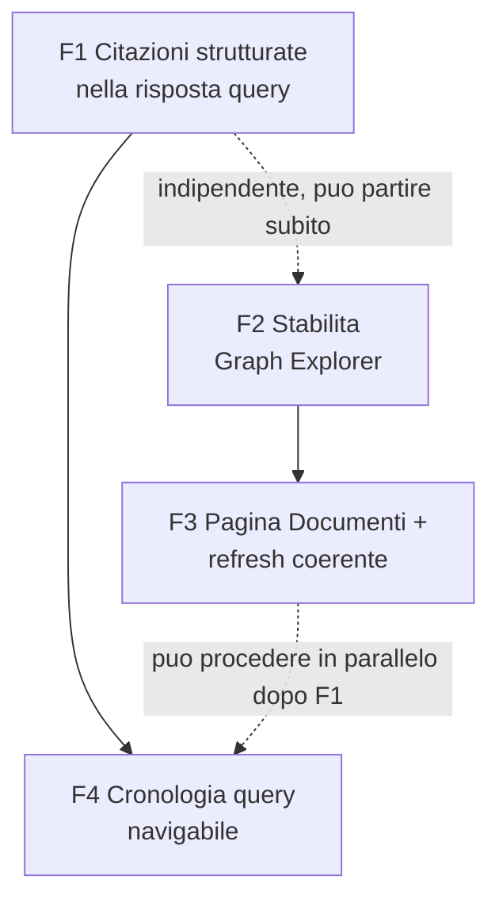

# Piano Implementativo — Fix post-Milestone 1

> Fonti di verità: [`milestone1.md`](./milestone1.md) (scope e semantica), [`milestone1-tech-spec.md`](./milestone1-tech-spec.md) (architettura) e [`milestone1-implementation-plan.md`](./milestone1-implementation-plan.md), di cui questo documento riprende esattamente lo stile (Epic → task con Rif/Dipende da/Stima/Descrizione/Dettagli implementativi/DoD, Acceptance Criteria per Epic). Copre 4 fix emersi dall'uso reale dell'app dopo il completamento di tutte le epic E0–E10, diagnosticati in chat prima di essere pianificati qui — nessuna nuova diagnosi in questo documento, solo l'implementazione.

---

## 0. Come leggere questo piano

- **Epic**: uno dei 4 fix richiesti, numerato `F1…F4`. Ogni Epic ha un'**Acceptance Criteria** — condizioni verificabili che rendono l'Epic "fatta" come sistema, non solo come somma di task.
- **Task**: `F<epic>.<n>`, con riferimento al codice reale coinvolto, dipendenze, stima (**S** = ore, **M** = 1 giorno circa), Descrizione, Dettagli implementativi concreti (file, funzioni, query), Definition of Done.
- **Track**: `BE`/`FE` — indicativo di dove vive il lavoro, non implica necessariamente sviluppatori diversi.
- **Ordine**: pensato per un solo flusso di lavoro sequenziale (non ci sono due team che aspettano contratti congelati come nel piano E0–E10), ma con due coppie che possono procedere in parallelo se ci sono più mani: F1↔F2 sono indipendenti fra loro; F4 dipende da F1 (riusa `cited_fact_ids`); F3 dipende da F2 (l'auto-refresh non va costruito sopra un componente che già scatta sotto carico).



| Fix | Epic | Rif. diagnosi | Track prevalente | Dipende da |
|---|---|---|---|---|
| 1 — risposta chat con ID nel testo | F1 | prompt `ANSWER_SYSTEM_PROMPT`, `query_engine.py` | BE | — |
| 2 — grafo che si blocca | F2 | `graph-encoding.ts`, `store.ts` (pulse) | FE | — |
| 3 — pagina Documenti + refresh coerente | F3 | nessuna pagina/endpoint dedicato oggi | BE→FE | F2 |
| 4 — cronologia query a tendina | F4 | nessuna persistenza query oggi | BE→FE | F1 |

---

## EPIC F1 — Citazioni strutturate nella risposta della chat

**Track:** BE · **Dipende da:** — · **Obiettivo:** l'ID di un fatto non deve più essere un token che il modello ricopia (e a volte storpia) dentro il testo libero della risposta — diventa un campo strutturato validato, come già accade per `facts_used`.

### Acceptance Criteria dell'Epic
- [x] `QueryResponse.answer` non contiene mai ID/UUID nel testo — verificato con un test automatico.
- [x] I fatti effettivamente citati sono un campo separato e tipizzato (`cited_fact_ids`), sempre sottoinsieme valido di `facts_used` — mai un ID inventato/storpiato dal modello.
- [x] Il frontend non fa più affidamento sul parsing di testo libero per capire cosa è stato citato.

### Task

#### F1.1 — Estendere lo schema di risposta LLM con `cited_fact_ids`
- **Rif:** `backend/app/pipeline/query_engine.py` (`class QueryAnswer`) · **Dipende da:** — · **Stima:** S
- **Descrizione:** aggiungere un campo strutturato all'output vincolato dell'LLM, così che citare un fatto sia la scelta di un campo tipizzato, non testo libero da interpretare dopo.
- **Dettagli implementativi:**
  ```python
  class QueryAnswer(BaseModel):
      answer: str = Field(description="Risposta in linguaggio naturale, senza ID o UUID nel testo.")
      cited_fact_ids: list[str] = Field(
          default_factory=list,
          description="ID (tra quelli forniti nel prompt) dei fatti usati per costruire answer.",
      )
  ```
  Nessun vincolo di formato sui valori: la responsabilità di restare "nell'insieme fornito" è del prompt (F1.2) + del filtro server-side (F1.3), non dello schema Pydantic.
- **Definition of Done:**
  - [ ] Unit test: istanza valida con `cited_fact_ids` vuoto e popolato; nessuna regressione sul campo `answer`.

#### F1.2 — Riscrivere il prompt: vietare ID nel testo, richiedere l'elenco nel campo dedicato
- **Rif:** `query_engine.py` (`ANSWER_SYSTEM_PROMPT`, `build_query_answer_prompt`) · **Dipende da:** F1.1 · **Stima:** S
- **Descrizione:** il vincolo che oggi spinge il modello a scrivere ID dentro `answer` è testuale, nel prompt — va riscritto esplicitamente, non basta aggiungere un campo che il modello può comunque ignorare.
- **Dettagli implementativi:** nuovo `ANSWER_SYSTEM_PROMPT`: *"...Non scrivere mai ID o UUID dentro il testo di `answer` — scrivi prosa naturale e leggibile, come se parlassi a una persona. Elenca invece in `cited_fact_ids` gli ID (tra quelli forniti sotto) dei fatti che hai usato per costruire la risposta."* Lo `user_prompt` resta strutturalmente invariato (lista `- [{id}] (doc={source_doc_id}) {text}` da `build_query_answer_prompt`): il modello continua a vedere gli ID per poterli riportare nel campo giusto, semplicemente non deve più incollarli nel testo.
- **Definition of Done:**
  - [ ] Unit test prompt builder: il system prompt contiene la frase di divieto; i placeholder del testo utente restano sostituiti correttamente (nessuna regressione sul test esistente `test_query_answer_prompt` se presente, altrimenti aggiornarlo).

#### F1.3 — Filtro difensivo server-side su `cited_fact_ids`
- **Rif:** `query_engine.py` (`run_query`) · **Dipende da:** F1.1, F1.2 · **Stima:** S
- **Descrizione:** anche con lo schema vincolato, nulla impedisce al modello di restituire un ID inventato o storpiato in `cited_fact_ids` — va filtrato lato server contro l'insieme reale di `facts_used`, con lo stesso spirito difensivo già applicato altrove nella pipeline (§18).
- **Dettagli implementativi:** dopo `answer_model = await call_structured(...)`:
  ```python
  valid_ids = {f.id for f in facts_used}
  cited = [fid for fid in answer_model.cited_fact_ids if fid in valid_ids]
  if not cited and facts_used:
      cited = [f.id for f in facts_used]  # fallback: meglio evidenziare tutto ciò che è stato passato al modello
  ```
  Il ramo di fallback (`except Exception` già esistente per il caso "chiamata LLM fallita") deve restituire `cited_fact_ids=[]` esplicitamente, coerente col fatto che in quel caso `answer` è già un fallback meccanico.
- **Definition of Done:**
  - [ ] Unit test: `cited_fact_ids` con un ID inventato → filtrato via, non compare nell'output.
  - [ ] Unit test: `cited_fact_ids` vuoto ma `facts_used` non vuoto → fallback applicato (tutti gli id di `facts_used`).

#### F1.4 — Propagare `cited_fact_ids` attraverso `QueryResponse` (backend + frontend)
- **Rif:** `backend/app/models/query.py` (`QueryResponse`), `frontend/lib/types.ts`, `frontend/lib/query-fixture.ts` · **Dipende da:** F1.3 · **Stima:** S
- **Descrizione:** il nuovo campo deve attraversare l'intero confine API, fixture inclusa (altrimenti la fixture diverge silenziosamente dallo schema reale, come già notato per altri campi in questo progetto).
- **Dettagli implementativi:** backend: `QueryResponse.cited_fact_ids: list[str] = Field(default_factory=list)`. Frontend (`types.ts`): `cited_fact_ids: string[]` aggiunto a `interface QueryResponse`. Aggiornare `QUERY_FIXTURE_RESPONSE` in `query-fixture.ts` con un valore plausibile per non rompere la modalità fixture di sviluppo (`NEXT_PUBLIC_USE_QUERY_FIXTURE=true`).
- **Definition of Done:**
  - [ ] `tsc --noEmit` pulito.
  - [ ] Unit test backend su `QueryResponse` con e senza `cited_fact_ids`.

#### F1.5 — Frontend: evidenziare le citazioni reali nella UI
- **Rif:** `frontend/components/QueryPanel.tsx` · **Dipende da:** F1.4 · **Stima:** S
- **Descrizione:** la UI usa già `facts_used` per i riquadri cliccabili (non fa parsing del testo) — ora può distinguere visivamente quali di quei fatti sono stati realmente citati nella risposta, invece di trattarli tutti allo stesso modo.
- **Dettagli implementativi:** nei riquadri sotto "Citazioni (N)", aggiungere un badge/bordo evidenziato (es. `border-primary` + icona) per ogni `fact.id` presente in `response.cited_fact_ids`; i fatti forniti al modello ma non citati restano visibili nella lista (per trasparenza sul contesto usato) ma senza badge.
- **Definition of Done:**
  - [ ] Verifica manuale: con la fixture aggiornata (F1.4), i fatti in `cited_fact_ids` sono visivamente distinguibili dagli altri nel pannello.

#### F1.6 — Test di non-regressione
- **Rif:** `backend/tests/test_query_integration.py` (o file dedicato) · **Dipende da:** F1.3 · **Stima:** S
- **Descrizione:** fissare con un test automatico che la funzionalità di citazione non torni a dipendere dal contenuto testuale di `answer`.
- **Dettagli implementativi:** test di integrazione che mocka `call_structured` per restituire un `QueryAnswer` plausibile (testo pulito + `cited_fact_ids` popolato) e verifica che `run_query` produca un `QueryResponse.cited_fact_ids` filtrato correttamente; grep nel codice frontend/backend per assicurarsi che non resti logica di estrazione ID da stringa libera (non dovrebbe essercene mai stata, ma è il canarino per il futuro).
- **Definition of Done:**
  - [ ] Suite verde; nessun punto del codice fa parsing di ID dentro `answer`.

---

## EPIC F2 — Stabilità del Graph Explorer

**Track:** FE · **Dipende da:** — · **Obiettivo:** eliminare gli scatti/blocchi percepiti durante ingest/dreaming attivi. **Fix mirato**: il componente com'è oggi è già buono (codifica visiva, interazioni, pannello dettaglio) — si toccano solo i due punti che causano il freeze, non si riscrive nulla.

### Acceptance Criteria dell'Epic
- [x] Durante un'ingestione/dreaming che produce una raffica di eventi ravvicinati, il Graph Explorer non mostra scatti percepibili — verificato manualmente ingerendo un documento che genera diversi fatti in sequenza.
- [x] Nodi/archi il cui stato visivo non cambia tra due render mantengono la stessa identità di oggetto (verificabile via unit test su `toNvlGraph`).
- [x] Nessuna regressione sulla codifica visiva di tech-spec §11.1 già validata in E7.2.

### Task

#### F2.1 — Batching dei pulse: una finestra condivisa invece di N timer indipendenti
- **Rif:** `frontend/lib/store.ts` (`pulseEntities`) · **Dipende da:** — · **Stima:** S
- **Descrizione:** oggi ogni evento pipeline che tocca un nodo apre il proprio `setTimeout(600ms)` indipendente; durante una raffica di eventi (tipica di un'estrazione o di una rilevazione relazioni) si sommano molte mutazioni di stato ravvicinate, ognuna delle quali forza un re-render dell'intero Graph Explorer.
- **Dettagli implementativi:** sostituire i timer per-chiamata con un'unica mappa `id → expiresAt` più un solo timer condiviso (avviato alla prima pulse, non ri-creato ad ogni chiamata) che periodicamente (es. ogni 150–200ms) rimuove le entry scadute e aggiorna `pulsingIds` in un colpo solo. `pulseEntities(ids)` diventa: aggiorna la mappa di scadenze, e se non c'è già un timer attivo ne avvia uno; il timer si auto-cancella quando la mappa torna vuota.
- **Definition of Done:**
  - [ ] Unit test: 5 chiamate a `pulseEntities` ravvicinate (entro la stessa finestra) risultano in un solo timer attivo (verificabile mockando `setTimeout`/`setInterval` con i fake timers di vitest e contando le invocazioni), non 5 timer paralleli.
  - [ ] Comportamento visivo del pulse (durata percepita ~600ms per id) invariato.

#### F2.2 — Identità stabile dei nodi/archi restituiti da `toNvlGraph`
- **Rif:** `frontend/lib/graph-encoding.ts` · **Dipende da:** — · **Stima:** M
- **Descrizione:** oggi `toNvlGraph` ricostruisce oggetti nuovi per ogni nodo/arco ad ogni chiamata, anche quando il loro stato visivo non è cambiato — costringendo `InteractiveNvlWrapper` a trattare l'intero grafo come modificato ad ogni re-render (selezione, dimming, pulse...). Si introduce una cache che riusa lo stesso riferimento quando la "firma" visiva non cambia.
- **Dettagli implementativi:** una `Map<string, { signature: string; value: NvlNode }>` (analoga per le relazioni) mantenuta a livello di modulo. In `encodeNode`/`encodeRelationship`: calcolare una stringa firma dai soli parametri che influenzano l'output (`type`, `is_latest`, `selected`, `dimmed`, `historyHighlighted`, `pulsing` per i nodi; `type`, `dimmed`, `historyHighlighted` per le relazioni); se coincide con l'ultima firma nota per quell'id, restituire l'oggetto già in cache invece di ricrearlo. In `toNvlGraph`, ripulire dalla cache le chiavi non più presenti nell'input corrente (evita crescita illimitata quando nodi/archi vengono rimossi, es. dopo un "Ricarica" con filtro `is_latest` cambiato).
- **Definition of Done:**
  - [ ] Unit test: due chiamate consecutive con identico input restituiscono, per ogni nodo, lo stesso riferimento oggetto (`toBe`/`Object.is`).
  - [ ] Unit test: una chiamata in cui cambia solo lo stato "pulsing" di un nodo restituisce un nuovo oggetto **solo** per quel nodo — tutti gli altri mantengono il riferimento precedente.
  - [ ] Unit test: la cache non trattiene riferimenti a id rimossi dall'input (verificabile ispezionando la dimensione della mappa dopo una chiamata con un sottoinsieme di id).

#### F2.3 — Verifica visiva di non-regressione
- **Rif:** `frontend/docs/e7-visual-encoding-checklist.md`, `frontend/lib/graph-visual-fixture.ts` (già esistenti da E7.2) · **Dipende da:** F2.1, F2.2 · **Stima:** S
- **Descrizione:** la stabilizzazione non deve alterare silenziosamente la codifica visiva già validata in E7.2.
- **Dettagli implementativi:** ripercorrere la checklist esistente con la fixture già presente, confrontando ogni combinazione type/is_latest/tipo relazione/pulsing/selezione.
- **Definition of Done:**
  - [ ] Checklist ripercorsa senza scostamenti rispetto a prima del fix.

---

## EPIC F3 — Pagina dedicata Ingestione/Documenti + refresh coerente delle dashboard

**Track:** BE → FE · **Dipende da:** F2 (non ha senso costruire auto-refresh sopra un Graph Explorer ancora instabile sotto carico) · **Obiettivo:** una pagina separata per ingerire e vedere i documenti ingeriti; ogni vista (Graph Explorer, nuova pagina Documenti) si aggiorna da sola dopo un'azione dell'utente, restando comunque refreshabile a mano.

### Acceptance Criteria dell'Epic
- [x] Esiste una pagina `/documents` con: form di ingest (spostato dalla dashboard principale), lista dei documenti ingeriti con conteggio chunk/fatti, bottone "Aggiorna" esplicito.
- [x] Ingerire o lanciare il dreaming da `/documents` resta visibile in tempo reale nel Pipeline Monitor della dashboard principale (`/`), anche se l'utente naviga via da dove ha lanciato l'azione — la sottoscrizione agli eventi non dipende da quale pagina è montata.
- [x] Al completamento di un'ingestione/dreaming (`pipeline_complete`), il Graph Explorer e la pagina Documenti si aggiornano da soli, senza richiedere un click manuale — che resta comunque disponibile.
- [x] Nessuna regressione delle funzionalità esistenti della dashboard principale (Graph Explorer, Query Panel, Pipeline Monitor) dopo lo spostamento del form di ingest.

### Task

#### F3.1 — Backend: endpoint di elenco documenti
- **Rif:** nuovo `backend/app/pipeline/documents_engine.py`, `backend/app/api/documents.py`, `backend/app/api/schemas.py` · **Dipende da:** — · **Stima:** M
- **Descrizione:** oggi non esiste alcun modo di elencare i documenti già ingeriti — serve un'aggregazione per `doc_id` su `Chunk`/`Fact`.
- **Dettagli implementativi:** nuovo modulo `documents_engine.py` con una funzione `list_documents(session) -> list[DocumentSummary]`. Query Cypher (verificare in implementazione se conviene una singola query con due `WITH` separati invece di un unico `OPTIONAL MATCH` per evitare che il join moltiplichi le righe):
  ```cypher
  MATCH (c:Chunk)
  WITH c.doc_id AS doc_id, count(c) AS chunk_count,
       min(c.created_at) AS first_at, max(c.created_at) AS last_at
  CALL {
    WITH doc_id
    MATCH (f:Fact {source_doc_id: doc_id})
    RETURN count(f) AS fact_count
  }
  RETURN doc_id, chunk_count, fact_count, first_at, last_at
  ORDER BY last_at DESC
  ```
  Nuovo schema `DocumentSummary{doc_id, chunk_count, fact_count, first_ingested_at, last_ingested_at}` e `DocumentListResponse{documents: list[DocumentSummary]}` in `schemas.py`. Nuovo handler `GET ""` nel router **esistente** `app/api/documents.py`, accanto al `POST ""` già presente (stesso prefix `/documents`).
- **Definition of Done:**
  - [ ] Test di integrazione: ingerito un documento con N chunk/M fatti, `GET /documents` lo elenca con conteggi corretti e timestamp coerenti.
  - [ ] Nessun documento ingerito → lista vuota, risposta 200 (non errore).
  - [ ] Due documenti con `doc_id` diversi → due righe distinte, ordinate per `last_ingested_at` decrescente.

#### F3.2 — Frontend: sottoscrizione SSE globale, disaccoppiata dal form di ingest
- **Rif:** `frontend/app/layout.tsx`, `frontend/lib/store.ts`, nuovo `frontend/components/PipelineEventSubscriber.tsx`, `frontend/components/PipelineEventBridge.tsx` · **Dipende da:** — · **Stima:** M
- **Descrizione:** prerequisito architetturale prima di spostare il form altrove. Oggi la sottoscrizione SSE (`useEventStream`) vive dentro lo stesso componente del form sulla dashboard principale; se il form si sposta su `/documents` senza questo refactor, gli eventi di un'azione lanciata da lì smetterebbero di arrivare al Pipeline Monitor non appena l'utente naviga fuori dalla pagina che li ha originati (lo store Zustand persiste tra le route, ma l'hook che alimenta lo store è montato solo dove vive il componente).
- **Dettagli implementativi:** nuovo slice nello store: `activeJobId: string | null`, `setActiveJobId: (id: string | null) => void`. Nuovo componente `PipelineEventSubscriber.tsx`, nessun output visivo, che legge `activeJobId` dallo store e guida `useEventStream({ jobId: activeJobId, enabled: useMock || Boolean(activeJobId) })`, spingendo gli eventi ricevuti nello store esattamente come oggi. Montato **una sola volta** in `app/layout.tsx` (persiste su tutte le route grazie alla navigazione client-side di Next.js). `PipelineEventBridge.tsx` si riduce ai soli controlli residui (indicatore modalità mock/sse, input `job_id` manuale per override, bottoni Reset/Replay mock) — la parte di form (doc_id/testo/bottoni Ingest/Dream) esce da qui e va in F3.3, che al posto di gestire lo stream in locale chiamerà `setActiveJobId(job_id)`.
- **Definition of Done:**
  - [ ] Test manuale: avviare un ingest da `/documents`, navigare su `/` prima del completamento — il Pipeline Monitor mostra gli eventi già in corso, non riparte da zero e non perde eventi.
  - [ ] La dashboard principale (`/`) continua a funzionare per un ingest lanciato direttamente da lì (nessuna regressione durante la transizione, anche se F3.3 non fosse ancora completata).

#### F3.3 — Frontend: nuova pagina `/documents`
- **Rif:** nuovo `frontend/app/documents/page.tsx`, nuovo `frontend/components/DocumentsPage.tsx`, `frontend/lib/api-client.ts`, `frontend/lib/types.ts` · **Dipende da:** F3.1, F3.2 · **Stima:** M
- **Descrizione:** la superficie richiesta — ingestione e documenti ingeriti in un posto dedicato, fuori dalla dashboard principale.
- **Dettagli implementativi:** nuova route Next.js `app/documents/page.tsx` → `<DocumentsPage />`. `DocumentsPage.tsx` con due sezioni: **(a)** form di ingest — markup e logica `onIngest`/`onDream` spostati da `PipelineEventBridge` (chiamano `postDocuments`/`postDreamingRun` come oggi, poi `setActiveJobId(job_id)` invece di gestire uno stream locale); **(b)** tabella documenti alimentata da una nuova `getDocuments()` in `api-client.ts` (+ tipo `DocumentSummary` in `types.ts`), colonne doc_id/chunk/fatti/ultimo aggiornamento, stesso pattern loading/error/empty già usato in `GraphExplorer.tsx` (per coerenza, non per riuso di codice — sono due domini diversi), bottone "Aggiorna" esplicito che incrementa un `reloadToken` locale.
- **Definition of Done:**
  - [ ] Pagina raggiungibile via URL diretto e via navigazione (F3.4).
  - [ ] Ingest reale da questa pagina produce, dopo "Aggiorna" o auto-refresh (F3.5), una riga nuova/aggiornata nella tabella con conteggi corretti.
  - [ ] Nessun redirect o comportamento bloccante verso la dashboard principale.

#### F3.4 — Frontend: navigazione tra le pagine
- **Rif:** `frontend/app/layout.tsx` o header condiviso · **Dipende da:** F3.3 · **Stima:** S
- **Descrizione:** senza un punto di navigazione visibile, la nuova pagina resta irraggiungibile dall'interfaccia.
- **Dettagli implementativi:** piccola barra di navigazione (in `layout.tsx`, sopra il contenuto di pagina, oppure integrata nell'header di `DashboardShell.tsx`) con due link Next.js (`<Link href="/">Dashboard</Link>`, `<Link href="/documents">Documenti</Link>`), stile coerente con l'header esistente, evidenziazione della pagina attiva (`usePathname()`).
- **Definition of Done:**
  - [ ] Navigazione visibile e funzionante da entrambe le pagine.
  - [ ] La pagina attiva è visivamente distinguibile nel nav.

#### F3.5 — Frontend: auto-refresh su `pipeline_complete`
- **Rif:** `frontend/components/GraphExplorer.tsx`, `frontend/components/DocumentsPage.tsx` · **Dipende da:** F2 (stabilizzazione), F3.2, F3.3 · **Stima:** S
- **Descrizione:** le due viste che mostrano dati derivati dalla pipeline (grafo, elenco documenti) devono aggiornarsi da sole quando un'ingestione/dreaming finisce, non solo su richiesta manuale — è il cuore del "tutte le dashboard si aggiornano bene rispetto alle azioni dell'utente".
- **Dettagli implementativi:** in entrambi i componenti, un `useEffect` che osserva `lastPipelineEvent` dello store (già esposto, già usato per i pulse in `GraphExplorer.tsx`) e, quando `event.stage === "done" && event.event === "pipeline_complete"`, incrementa il proprio `reloadToken` locale — riusando lo stesso meccanismo già collegato al bottone "Ricarica"/"Aggiorna", non un percorso di fetch parallelo. Nessun polling: puramente event-driven, coerente con l'architettura SSE già in uso.
- **Definition of Done:**
  - [ ] Test manuale: ingest/dream lanciati da `/documents`; al termine (evento `pipeline_complete` visibile nel Pipeline Monitor su `/`), sia il Graph Explorer sia la tabella Documenti mostrano i nuovi dati senza click manuali.
  - [ ] I bottoni manuali "Ricarica"/"Aggiorna" restano funzionanti e producono lo stesso identico effetto.

#### F3.6 — Test di non-regressione della dashboard principale
- **Rif:** `frontend/lib/*.test.ts`, verifica manuale `DashboardShell` · **Dipende da:** F3.2–F3.5 · **Stima:** S
- **Descrizione:** il refactor tocca un componente condiviso (`PipelineEventBridge`) — va verificato che Query Panel, Graph Explorer e il toggle mock/reale restino intatti.
- **Dettagli implementativi:** rieseguire `npm test` (vitest) e `tsc --noEmit`; verifica manuale che con `NEXT_PUBLIC_USE_MOCK_EVENTS=true` il Pipeline Monitor mostri ancora la sequenza mock (il subscriber globale deve rispettare lo stesso flag).
- **Definition of Done:**
  - [ ] Suite verde, nessuna regressione visiva/funzionale osservata su nessuna delle due modalità (mock/reale).

---

## EPIC F4 — Cronologia query navigabile tramite menu a tendina

**Track:** BE → FE · **Dipende da:** F1 (riusa il campo `cited_fact_ids` nello snapshot salvato) · **Obiettivo:** ogni query eseguita viene salvata; un menu a tendina nel Query Panel permette di tornare a una risposta passata senza rieseguirla.

### Acceptance Criteria dell'Epic
- [x] Ogni chiamata a `POST /query` che produce una risposta viene salvata in Neo4j come nodo `QueryLog`, collegato ai fatti usati.
- [x] Un fallimento nel salvataggio del log non fa mai fallire la risposta della query all'utente (side-effect non bloccante, coerente con lo spirito di §18).
- [x] Il menu a tendina nel Query Panel elenca le query passate (più recenti per prime); selezionarne una ripopola risposta, citazioni ed evidenziazione del grafo **senza** rieseguire ricerca vettoriale o chiamata LLM.

### Task

#### F4.1 — Schema Neo4j: nodo `QueryLog`
- **Rif:** `backend/app/db/schema.cypher`, `backend/app/db/schema.py` · **Dipende da:** — · **Stima:** S
- **Descrizione:** serve identità univoca e un indice per l'ordinamento cronologico, sullo stesso modello di `fact_id`/`chunk_id`.
- **Dettagli implementativi:** aggiungere a `schema.cypher`:
  ```cypher
  CREATE CONSTRAINT query_log_id IF NOT EXISTS FOR (q:QueryLog) REQUIRE q.id IS UNIQUE;
  CREATE INDEX query_log_created_at IF NOT EXISTS FOR (q:QueryLog) ON (q.created_at);
  ```
  Aggiungere `"query_log_id"` a `REQUIRED_CONSTRAINTS` in `schema.py`.
- **Definition of Done:**
  - [ ] Dopo bootstrap, `SHOW CONSTRAINTS`/`SHOW INDEXES` mostrano i nuovi oggetti.
  - [ ] Test analogo a quello esistente in `test_schema.py`, esteso al nuovo constraint/indice.

#### F4.2 — Backend: scrittura del log ad ogni query
- **Rif:** nuovo `backend/app/pipeline/query_log.py`, `query_engine.py` (`run_query`) · **Dipende da:** F4.1, F1.4 (campo `cited_fact_ids` disponibile) · **Stima:** M
- **Descrizione:** persistere testo, risposta e provenienza di ogni query eseguita, come snapshot immutabile (non stato live) — coerente con l'ethos temporale già presente nel progetto (`is_latest`, catene `UPDATES`).
- **Dettagli implementativi:** `query_log.py`:
  ```python
  async def write_query_log(
      session, *, query_id, text, answer, cited_fact_ids, all_fact_ids
  ) -> None:
      await session.run(
          "CREATE (q:QueryLog {id:$id, text:$text, answer:$answer, "
          "cited_fact_ids:$cited, created_at: datetime()})",
          id=query_id, text=text, answer=answer, cited=cited_fact_ids,
      )
      await session.run(
          "MATCH (q:QueryLog {id:$id}) UNWIND $fact_ids AS fid "
          "MATCH (f:Fact {id: fid}) MERGE (q)-[:USED]->(f)",
          id=query_id, fact_ids=all_fact_ids,
      )
  ```
  Collega **tutti** i `facts_used` (non solo i citati) per poter ricostruire l'intero `subgraph` storico in F4.3. In `run_query`, dopo aver costruito `QueryResponse`, chiamata avvolta in `try/except Exception` che logga un warning ma non altera né interrompe la risposta già pronta (il log è un side-effect, mai sul percorso critico).
- **Definition of Done:**
  - [ ] Test di integrazione: dopo una query reale (LLM mockato), esiste un nodo `QueryLog` con `USED` verso i fatti attesi e `cited_fact_ids` coerente con la risposta.
  - [ ] Test: un fallimento simulato della scrittura del log (mock che solleva eccezione) non impedisce comunque una risposta HTTP 200 con il payload atteso da `POST /query`.

#### F4.3 — Backend: endpoint elenco e dettaglio cronologia
- **Rif:** nuovo router `backend/app/api/query_history.py`, `schemas.py`, `backend/app/main.py` (registrazione router) · **Dipende da:** F4.2 · **Stima:** M
- **Descrizione:** superficie REST per popolare il menu a tendina e recuperare una query passata senza rieseguirla.
- **Dettagli implementativi:**
  - `GET /queries?limit=20` → `QueryHistoryResponse{items: list[QueryHistoryEntry]}`, `QueryHistoryEntry{id, text, created_at}` — query leggera (solo id/testo/data), `ORDER BY created_at DESC LIMIT $limit`.
  - `GET /queries/{id}` → ricostruisce un oggetto forma-`QueryResponse` dal nodo loggato: `answer` e `cited_fact_ids` letti direttamente dal nodo `QueryLog`; `facts_used` e `subgraph` ricostruiti dai fatti collegati via `USED` (snapshot al momento della query — se un fatto è nel frattempo diventato storico, lo storico mostra comunque cosa fu risposto allora, non lo stato attuale); 404 se `id` non esiste.
  - Registrare il nuovo router in `main.py` accanto agli altri (`app.include_router(query_history.router)`).
- **Definition of Done:**
  - [ ] Test integrazione: elenco rispecchia l'ordine cronologico corretto e rispetta `limit`.
  - [ ] Test: dettaglio di un id noto restituisce lo stesso `answer`/`cited_fact_ids` salvati in F4.2.
  - [ ] Test: id inesistente → 404.

#### F4.4 — Frontend: tipi e client API
- **Rif:** `frontend/lib/types.ts`, `frontend/lib/api-client.ts` · **Dipende da:** F4.3 · **Stima:** S
- **Descrizione:** estendere il confine tipizzato con la nuova superficie, seguendo esattamente le convenzioni esistenti (E6.2).
- **Dettagli implementativi:** `QueryHistoryEntry{id: string; text: string; created_at: string}`, `QueryHistoryResponse{items: QueryHistoryEntry[]}`; `getQueryHistory(limit？: number)` e `getQueryLogDetail(id: string)` in `api-client.ts`, stesso pattern di `request<T>()` già usato da tutte le altre funzioni del client.
- **Definition of Done:**
  - [ ] `tsc --noEmit` pulito.

#### F4.5 — Frontend: menu a tendina nel Query Panel
- **Rif:** `frontend/components/QueryPanel.tsx` · **Dipende da:** F4.4, F1.5 (badge citazioni riusato per coerenza visiva) · **Stima:** M
- **Descrizione:** la UI di navigazione richiesta dal fix.
- **Dettagli implementativi:** elemento `<select>` (nativo, stile coerente col resto del pannello minimale — nessuna nuova dipendenza UI necessaria) popolato da `getQueryHistory()` al mount **e** ri-fetchato dopo ogni submit riuscita (così la query appena fatta compare subito in cima alla lista). Alla selezione di una voce: chiamata a `getQueryLogDetail(id)`, poi popolamento dello stesso stato `response` + `setQuerySubgraph(...)` già usati per una query fresca (righe 48-49 di `onSubmit`) — **nessuna** nuova chiamata a `POST /query`. Etichetta di ogni voce: testo troncato (~40 caratteri) + data/ora leggibile.
- **Definition of Done:**
  - [ ] Verifica manuale: due query in sequenza, il menu le elenca entrambe, più recente in cima.
  - [ ] Selezionando la voce più vecchia, il pannello mostra la sua risposta originale e il grafo evidenzia il suo subgraph originale — nessuna richiesta di rete verso `/query` osservabile (solo verso `/queries/{id}`).

#### F4.6 — Test complessivo
- **Rif:** `backend/tests/`, `frontend/lib/*.test.ts` · **Dipende da:** F4.1–F4.5 · **Stima:** S
- **Descrizione:** chiudere l'Epic con una verifica end-to-end della cronologia.
- **Dettagli implementativi:** test backend che incatena due `run_query` con testi diversi e verifica `GET /queries` (entrambe presenti, ordine corretto) + `GET /queries/{id}` per ciascuna; test frontend (vitest) sul rendering del menu a partire da una fixture di history e sulla selezione che popola lo stato senza chiamare `postQuery`.
- **Definition of Done:**
  - [ ] Suite backend e frontend verdi.

---

## Riepilogo dipendenze critiche (per non ambiguità)

- **F1 va fatta per prima tra i due fix backend**: F4.2 riusa direttamente `cited_fact_ids` nello snapshot del log — costruire la cronologia prima del fix alla citazione significherebbe salvare da subito risposte "sporche" con ID nel testo, da correggere una seconda volta.
- **F2 va fatta prima di F3.5**: l'auto-refresh su `pipeline_complete` aggiunge un ulteriore trigger di re-render al Graph Explorer — costruirlo sopra un componente che già scatta sotto raffiche di eventi aggraverebbe il sintomo invece di risolverlo insieme.
- **F3.2 (subscription SSE globale) è un prerequisito degli altri task di F3, non un dettaglio rimandabile**: senza questo refactor, spostare il form su `/documents` (F3.3) romperebbe silenziosamente il Pipeline Monitor per ogni azione lanciata da quella pagina — l'ordine F3.1 → F3.2 → F3.3 → F3.4 → F3.5 → F3.6 non è intercambiabile sui primi tre task.
- **F4.3 dipende dal reale contenuto salvato in F4.2**, non solo dalla sua esistenza: se F4.2 salva uno snapshot incompleto (es. manca `cited_fact_ids` perché F1 non è stata completata prima), il dettaglio ricostruito in F4.3 sarà incompleto a sua volta — da qui la dipendenza dell'intero Epic F4 da F1.
- **Nessuno dei 4 fix richiede di toccare il modello dati Neo4j esistente per `Fact`/`Chunk`/`UPDATES`/`EXTENDS`/`DERIVES`** — F3.1 legge dati già presenti, F4.1 aggiunge solo un nuovo label `QueryLog` isolato. Tutti i criteri di accettazione di `milestone1.md` §8 restano validi e non vanno ri-verificati da zero, salvo la suite di regressione già prevista in ciascun Epic.