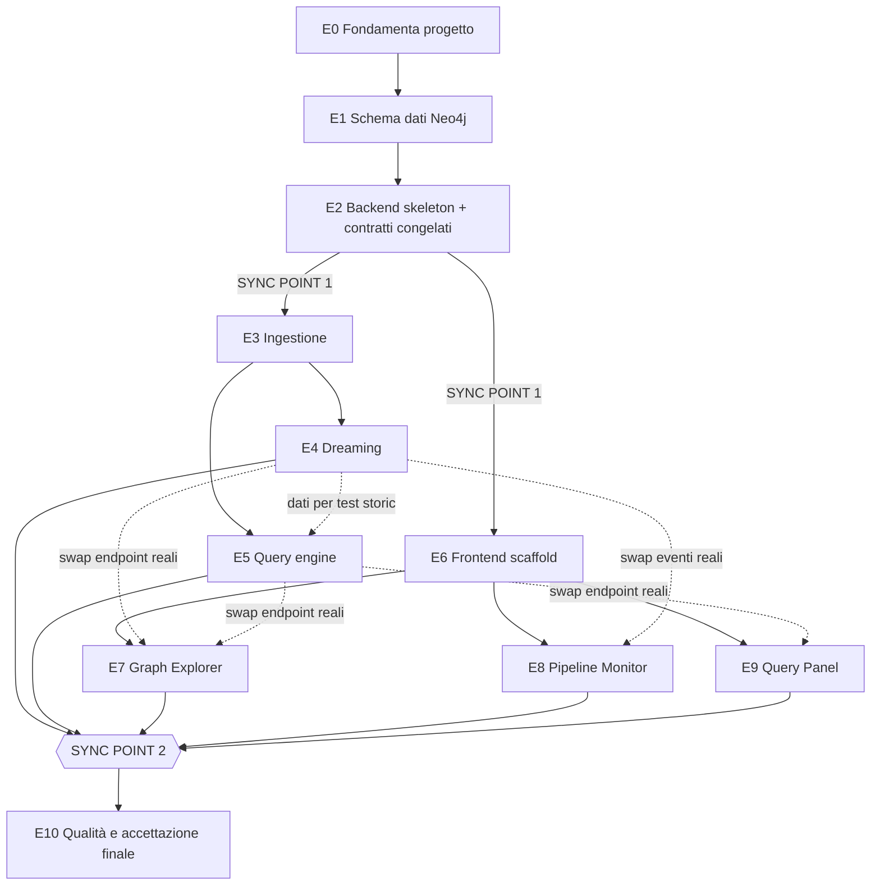

# Piano Implementativo — Milestone 1 (Motore del Grafo dei Fatti su Neo4j)

> Fonti di verità: [`milestone1.md`](./milestone1.md) (scope e semantica) e [`milestone1-tech-spec.md`](./milestone1-tech-spec.md) (architettura e contratti tecnici). Questo documento **non aggiunge né cambia** requisiti: li scompone in task eseguibili e ordinate per un team di sviluppo.

---

## 0. Come leggere questo piano

- **Macro-task (Epic)**: unità di consegna con un obiettivo coerente, numerate `E0…E10` nell'ordine imposto da `milestone1-tech-spec.md` §16. Ogni Epic ha una propria **Acceptance Criteria**: una checklist di condizioni che devono essere vere perché l'Epic nel suo insieme sia considerata chiusa — non è la somma meccanica delle DoD delle singole task, ma la verifica che il pezzo di sistema consegnato *funzioni come sistema*.
- **Task**: unità di lavoro dentro un Epic, con ID `E<epic>.<n>`. Ogni task riporta: riferimento alla sezione di spec, dipendenze, stima, **Descrizione** (cosa e perché), **Dettagli implementativi** (come, a livello di file/funzioni/query concrete) e **Definition of Done** verificabile.
- **Stima** a T-shirt size: **S** = ore, **M** = 1 giorno circa, **L** = 2-3 giorni. Nessuna task di questo piano è stata lasciata **XL** — se in planning una task risultasse più grande, va spezzata ulteriormente prima di iniziare.
- **Track**: chi può lavorare la task in parallelo — `BE` (backend), `FE` (frontend), `DevOps/QA`. Le task con lo stesso track e stesso Epic sono sequenziali fra loro salvo indicazione contraria; task di track diversi possono procedere in parallelo se le dipendenze lo consentono.
- **Efficienza dell'ordine**: dopo l'Epic 2 (che congela contratti API/eventi/schemi), Backend e Frontend procedono **in parallelo su due binari** invece che in sequenza stretta — il Frontend lavora contro stub/fixture conformi agli schemi congelati e fa lo "swap" a endpoint reali quando il Backend li consegna. Questo è il principale acceleratore rispetto a un ordine puramente sequenziale "prima tutto il backend, poi tutto il frontend".

**Definition of Done del milestone**: tutti gli 8 criteri di accettazione di `milestone1.md` §8 verdi come test automatici (E10.1) **e** verificati manualmente in UI (E10.2).

---

## EPIC 0 — Fondamenta di progetto

**Track:** DevOps/QA · **Blocca:** tutto · **Dipende da:** — · **Obiettivo:** repo pronto, toolchain funzionanti, CI verde su codice vuoto.

### Acceptance Criteria dell'Epic
- [ ] Un nuovo membro del team può clonare il repo, seguire il README e avere backend+frontend in esecuzione locale in meno di 15 minuti.
- [ ] `docker compose up neo4j` porta su un'istanza Neo4j con GDS caricato, verificabile via `CALL gds.version()`.
- [ ] La CI esegue automaticamente lint+test su ogni push/PR e risulta verde sullo scheletro vuoto.
- [ ] Nessuna logica applicativa (modelli, endpoint, componenti React) è stata scritta in questa Epic: E0 fornisce solo infrastruttura, così le epic successive partono da una base pulita e condivisa.

### Task

#### E0.1 — Inizializzare repo con struttura cartelle
- **Rif:** tech-spec §13 · **Dipende da:** — · **Stima:** S
- **Descrizione:** creare lo scheletro di cartelle definito in tech-spec §13, così che ogni epic successiva sappia esattamente dove va il proprio codice, senza decisioni ad-hoc lasciate a metà sviluppo.
- **Dettagli implementativi:**
  - Creare `/backend/app/{api,core,pipeline,models}`, `/backend/tests`, `/frontend/app`, `/frontend/components`, `/frontend/lib`, come da struttura repo di tech-spec §13.
  - `.gitignore` per Python (`__pycache__`, `.venv`) e Node (`node_modules`, `.next`).
  - `README.md` root con link a `milestone1.md`, `milestone1-tech-spec.md` e a questo piano.
  - Fissare la convenzione commit (es. Conventional Commits: `feat/fix/chore/test`) e annotarla nel README, per coerenza nel team lungo tutte le epic successive.
- **Definition of Done:**
  - [ ] Struttura cartelle presente e pushata, anche vuota (`.gitkeep` dove serve).
  - [ ] README root naviga alla documentazione dei tre file.

#### E0.2 — Toolchain backend
- **Rif:** tech-spec §3 · **Dipende da:** E0.1 · **Stima:** S
- **Descrizione:** mettere in piedi l'ambiente Python con tutte le dipendenze elencate nello stack tecnologico (§3), così che ogni epic backend successiva parta da un ambiente già pronto e uniforme per tutto il team.
- **Dettagli implementativi:**
  - `pyproject.toml` con: `fastapi`, `uvicorn[standard]`, `neo4j` (driver async), `pydantic>=2`, `openai`, `sentence-transformers`, `tenacity`, `python-dotenv`; dev: `pytest`, `pytest-asyncio`, `testcontainers[neo4j]`, `ruff`.
  - Pin di versioni compatibili (driver Neo4j ≥5.19 con il server; `pydantic` v2 esplicito per evitare drift verso v1).
  - `app/main.py` minimale con `FastAPI()` ed endpoint placeholder `/health` → `{"status": "not_implemented"}`.
  - Config `ruff` con regole base (line length, ordine import).
- **Definition of Done:**
  - [ ] Installazione dipendenze senza conflitti.
  - [ ] `uvicorn app.main:app --reload` avvia e risponde 200 su `/health`.
  - [ ] `pytest` gira senza errori anche a zero test raccolti.
  - [ ] `ruff check .` passa senza errori sullo scheletro.

#### E0.3 — Toolchain frontend
- **Rif:** tech-spec §3, §13 · **Dipende da:** E0.1 · **Stima:** S
- **Descrizione:** inizializzare il progetto Next.js con tutte le librerie che serviranno alle Epic 6-9 (UI kit, libreria grafo, state management), per evitare di doverle installare/configurare a metà sviluppo.
- **Dettagli implementativi:**
  - `create-next-app` con App Router + TypeScript + Tailwind.
  - Installare `shadcn/ui` (init + componenti base: button, card, tabs, sheet, dialog — serviranno a E6/E7).
  - Installare `@neo4j-nvl/react` (E7) e `zustand` (E6.3).
  - `next.config.js`/env: `NEXT_PUBLIC_API_URL` letta da variabile d'ambiente, coerente col docker-compose di §12.
- **Definition of Done:**
  - [ ] `npm run dev` mostra una pagina placeholder senza errori console.
  - [ ] `npm run build` completa senza errori di tipo.
  - [ ] `npm run lint` passa.

#### E0.4 — CI skeleton
- **Rif:** — · **Dipende da:** E0.2, E0.3 · **Stima:** S
- **Descrizione:** garantire che da subito ogni PR sia validata automaticamente, evitando che errori di lint/build banali arrivino in review manuale.
- **Dettagli implementativi:**
  - Workflow CI con due job paralleli: `backend` (`ruff check` + `pytest`) e `frontend` (`npm ci && npm run lint && npm run build`).
  - Trigger su `push` e `pull_request` verso il branch principale.
  - Cache dipendenze (pip/npm) per velocità — non bloccante per il DoD, ma consigliata.
- **Definition of Done:**
  - [ ] Pipeline visibile nel repo, entrambi i job verdi sullo scheletro dei task precedenti.
  - [ ] Verificato una volta che un fallimento intenzionale fa fallire il job corrispondente, poi ripristinato.

#### E0.5 — Docker Compose: solo Neo4j
- **Rif:** tech-spec §12 · **Dipende da:** E0.1 · **Stima:** S
- **Descrizione:** rendere disponibile a tutto il team un'istanza Neo4j+GDS riproducibile, base per Epic 1 e per lo sviluppo locale di tutte le epic backend.
- **Dettagli implementativi:**
  - `docker-compose.yml` con il solo servizio `neo4j`, esattamente come tech-spec §12 (`neo4j:5.24-community`, `NEO4J_PLUGINS: '["graph-data-science"]'`, `NEO4J_dbms_security_procedures_unrestricted: gds.*`).
  - `.env.example` con `NEO4J_PASSWORD`.
  - Volume nominato `neo4j_data` per persistenza tra restart.
- **Definition of Done:**
  - [ ] `docker compose up neo4j` espone Browser su `:7474` e Bolt su `:7687`.
  - [ ] Login con le credenziali da `.env` riesce.
  - [ ] `CALL gds.version()` in Neo4j Browser restituisce una versione.

---

## EPIC 1 — Schema dati Neo4j

**Track:** BE · **Dipende da:** E0.5 · **Obiettivo:** modello dati (tech-spec §4) applicato e verificato.

### Acceptance Criteria dell'Epic
- [ ] Un Neo4j appena creato (senza intervento manuale) ha tutti i constraint, indici e i due vector index attesi da tech-spec §4.2.
- [ ] Applicare lo schema due volte di fila non produce errori né duplicati (idempotenza verificata).
- [ ] I vector index su `Fact.embedding` e `Chunk.embedding` sono a 768 dimensioni / similarità coseno — precondizione hard per ogni ricerca vettoriale delle epic successive (E4, E5).

### Task

#### E1.1 — Script Cypher idempotente
- **Rif:** tech-spec §4.2 · **Dipende da:** E0.5 · **Stima:** M
- **Descrizione:** tradurre 1:1 il blocco Cypher di tech-spec §4.2 in uno script versionato nel repo, unica fonte di verità per lo schema.
- **Dettagli implementativi:**
  - File `backend/app/db/schema.cypher` (o lista di statement Python) con esattamente: constraint `fact_id`, `chunk_id`; indici `fact_is_latest`, `fact_type`, `fact_doc`, `chunk_doc`; vector index `fact_embedding`, `chunk_embedding` (768 dim, cosine).
  - Ogni statement con `IF NOT EXISTS`, senza eccezioni — è la garanzia di idempotenza richiesta dal criterio d'Epic.
  - Eseguire statement per statement via driver Neo4j (Neo4j non supporta multi-statement DDL misto in un'unica query).
- **Definition of Done:**
  - [ ] Eseguire lo script due volte di fila non produce errori.
  - [ ] `SHOW CONSTRAINTS` elenca `fact_id`, `chunk_id`.
  - [ ] `SHOW INDEXES` elenca i 4 indici btree + i 2 vector index con `dimensions: 768` e `similarityFunction: 'COSINE'`.

#### E1.2 — Bootstrap automatico schema all'avvio backend
- **Rif:** tech-spec §4.2 · **Dipende da:** E1.1, E0.2 · **Stima:** S
- **Descrizione:** eliminare il passo manuale "applica lo schema" dal flusso di sviluppo/deploy: chi avvia il backend contro un Neo4j vuoto ottiene automaticamente lo schema corretto.
- **Dettagli implementativi:**
  - `scripts/init_db.py` richiamabile standalone **e** hook `@app.on_event("startup")` in FastAPI che lo richiama, dietro un flag env `AUTO_MIGRATE` (default `true` in dev).
- **Definition of Done:**
  - [ ] Avviare il backend contro un Neo4j vuoto crea automaticamente tutto lo schema (verificato via `SHOW INDEXES`).
  - [ ] Riavviare il backend una seconda volta non produce errori né side-effect visibili.

#### E1.3 — Test di verifica schema
- **Rif:** tech-spec §4.2 · **Dipende da:** E1.1 · **Stima:** S
- **Descrizione:** rendere la correttezza dello schema un fatto verificato automaticamente in CI, non solo controllato a mano una volta.
- **Dettagli implementativi:**
  - Test `pytest` con fixture `testcontainers.neo4j.Neo4jContainer` (community + GDS abilitato via env del container).
  - Applica E1.1, poi interroga `SHOW INDEXES YIELD name, type, options` e asserisce dimensione 768 e `cosine` sui due vector index.
- **Definition of Done:**
  - [ ] Test verde in locale e in CI (richiede Docker nel runner — annotare come prerequisito infrastrutturale per E0.4/E10.5).

---

## EPIC 2 — Backend skeleton + contratti congelati

**Track:** BE · **Dipende da:** E1 · **Obiettivo:** infrastruttura backend comune (config, driver, eventi, resilienza LLM) e **superficie API/schemi congelati** — è lo sblocco per far partire il Frontend in parallelo.

### Acceptance Criteria dell'Epic
- [ ] Tutti gli endpoint elencati in tech-spec §9 esistono, rispondono con status corretto e payload conforme agli schemi Pydantic di §17 (anche se con dati fittizi).
- [ ] Il Frontend (Epic 6+) può iniziare l'integrazione senza dover aspettare nessuna Epic successiva del Backend.
- [ ] `GET /health` riflette lo stato reale di Neo4j e GDS, non un valore statico.
- [ ] Il wrapper LLM (E2.4) è l'unico punto del codebase da cui parte una chiamata OpenAI — nessuna epic successiva chiama l'SDK direttamente, così retry/timeout/concorrenza si applicano sempre, ovunque.

### Task

#### E2.1 — App FastAPI + config + Neo4j client
- **Rif:** tech-spec §3, §12 · **Dipende da:** E1.2 · **Stima:** M
- **Descrizione:** infrastruttura comune che ogni router/servizio successivo userà per parlare con Neo4j e leggere configurazione.
- **Dettagli implementativi:**
  - `app/core/config.py`: `Settings(BaseSettings)` (pydantic-settings) che legge `NEO4J_URI`, `NEO4J_USER`, `NEO4J_PASSWORD`, `OPENAI_API_KEY`, `OPENAI_MODEL` (default `gpt-4o-mini`), `EMBEDDING_MODEL` (default `BAAI/bge-base-en-v1.5`).
  - `app/core/neo4j_client.py`: wrapper su `neo4j.AsyncGraphDatabase.driver(...)`, esposto come dependency FastAPI (`Depends(get_neo4j_session)`), driver creato allo startup e chiuso allo shutdown.
  - `GET /health`: esegue `RETURN 1` su Neo4j e `CALL gds.version()`; 200 `{"neo4j":"ok","gds":"ok"}` o 503 con dettaglio se una delle due fallisce.
- **Definition of Done:**
  - [ ] `/health` risponde 200 quando Neo4j+GDS sono su, 503 con messaggio chiaro quando Neo4j è giù (verificato spegnendo il container).
  - [ ] Config leggibile sia da `.env` locale sia da env vars del container Docker.

#### E2.2 — Modelli Pydantic completi
- **Rif:** tech-spec §17.1–§17.4 · **Dipende da:** E2.1 · **Stima:** M
- **Descrizione:** congelare qui, letteralmente, i modelli riportati in tech-spec §17 — sono il contratto dati condiviso tra prompt LLM, scrittura su Neo4j e risposte REST per tutto il resto del progetto.
- **Dettagli implementativi:**
  - `app/models/extraction.py`: `FactType`, `ExtractedFact`, `FactExtractionResult` (§17.1).
  - `app/models/consolidation.py`: `ConsolidationOutcome`, `ConsolidationResult` con il `model_validator` che impone `source_fact_ids` non vuoto quando `outcome=="abstraction"` (§17.2).
  - `app/models/relations.py`: `RelationLabel`, `RelationClassification` (§17.3).
  - `app/models/query.py`: `FactUsed`, `SubgraphNode`, `SubgraphRelationship`, `Subgraph`, `QueryResponse` (§17.4).
  - Copiare i modelli **esattamente** come definiti in tech-spec §17 — nessuna epic successiva li modifica senza prima aggiornare la spec.
- **Definition of Done:**
  - [ ] Unit test per ciascun modello: un caso valido → istanza creata; un caso invalido → `ValidationError` (in particolare `abstraction` senza `source_fact_ids`).
  - [ ] `import app.models` non solleva errori (nessun import circolare).

#### E2.3 — Event bus + endpoint SSE
- **Rif:** tech-spec §2, §9, §10 · **Dipende da:** E2.1 · **Stima:** M
- **Descrizione:** canale di comunicazione realtime backend→frontend usato da tutte le fasi della pipeline (E3, E4) per notificare progresso, secondo lo schema evento di §10.
- **Dettagli implementativi:**
  - `app/core/event_bus.py`: registro di code `asyncio.Queue` indicizzate per `job_id`; `publish(job_id, stage, event, payload)` costruisce `{ts, job_id, stage, event, payload}` (schema §10) e lo mette in coda a tutti i subscriber del `job_id`.
  - `GET /events/stream?job_id=`: `StreamingResponse` (`media_type="text/event-stream"`), `yield f"data: {json.dumps(event)}\n\n"`; chiude lo stream alla ricezione di `stage="done"`.
  - Rimozione della coda dal registro alla disconnessione del client (evita leak di memoria).
- **Definition of Done:**
  - [ ] Test: pubblicazione manuale di 2-3 eventi fixture su un `job_id`, un client SSE li riceve nell'ordine corretto e nel formato atteso.
  - [ ] Nessun leak di code dopo la disconnessione di un client (verificabile contando le entry nel registro prima/dopo).

#### E2.4 — Wrapper LLM client con resilienza
- **Rif:** tech-spec §18 · **Dipende da:** E2.1 · **Stima:** L
- **Descrizione:** implementare **una sola volta** tutta la policy di resilienza di tech-spec §18, così che estrazione (E3), consolidamento/classificazione (E4) e query (E5) la ereditino senza duplicare logica di retry.
- **Dettagli implementativi:**
  - `app/core/llm_client.py`, `call_structured(system_prompt, user_prompt, response_model: type[BaseModel], temperature=0) -> BaseModel`.
  - Retry `tenacity`: `stop_after_attempt(3)`, `wait_exponential` (1s/2s/4s), limitato a timeout/429/5xx (mappare le eccezioni specifiche dell'SDK `openai`).
  - Timeout per chiamata: 30s.
  - Dopo la risposta: `response_model.model_validate_json(...)`; un `ValidationError` **non** rientra nella retry policy — propagato subito come eccezione dedicata (`LLMValidationError`) gestita dal chiamante (E3.5/E4.8 definiscono il comportamento "continua col resto del batch").
  - `asyncio.Semaphore(settings.LLM_MAX_CONCURRENCY)` (default 5) condiviso a livello di modulo.
  - Accumulo `usage.total_tokens` per `job_id`, letto da chi costruisce l'evento `pipeline_complete` (§10).
- **Definition of Done:**
  - [ ] Unit test: eccezione di timeout simulata (SDK mockato) → 3 tentativi totali, poi eccezione propagata.
  - [ ] Unit test: risposta non valida contro lo schema → **nessun** retry, `LLMValidationError` immediata.
  - [ ] Unit test: 6 chiamate concorrenti con semaforo a 5 → la sesta parte solo dopo che una delle prime 5 completa.

#### E2.5 — Stub di tutti gli endpoint REST
- **Rif:** tech-spec §9 · **Dipende da:** E2.2 · **Stima:** M
- **Descrizione:** esporre subito l'intera superficie API di tech-spec §9 con dati fittizi ma schema-validi, per sbloccare il Frontend (SYNC POINT 1) senza aspettare che la logica reale sia pronta.
- **Dettagli implementativi:**
  - Router: `documents.py` (`POST /documents`), `dreaming.py` (`POST /dreaming/run`), `graph.py` (`GET /graph`), `facts.py` (`GET /facts/{id}`, `GET /facts/{id}/history`), `query.py` (`POST /query`), `reconcile.py` (`POST /reconcile`).
  - Ogni handler restituisce una fixture costruita **istanziando i modelli Pydantic di E2.2** (non dizionari a mano) — garantisce che lo stub sia davvero conforme allo schema che il Frontend userà.
  - Verificare che FastAPI pubblichi `/docs` e `/openapi.json` correttamente.
- **Definition of Done:**
  - [ ] Tutti gli endpoint di §9 rispondono 200/202 con payload che passa la validazione del proprio response model.
  - [ ] `/docs` mostra tutti gli endpoint con schemi request/response leggibili.
  - [ ] Il Frontend (E6.2) chiama ogni endpoint stub e deserializza la risposta senza errori di tipo.

> ⚑ **SYNC POINT 1** — da qui Track BE (E3→E5) e Track FE (E6→E9) procedono in parallelo.

---

## EPIC 3 — Pipeline di ingestione

**Track:** BE · **Dipende da:** E2 · **Rif:** tech-spec §5, §17.1

### Acceptance Criteria dell'Epic
- [ ] Ingerire un documento reale produce `Chunk` + `Fact` con `DERIVED_FROM` corretta in Neo4j (criterio `milestone1.md` §8).
- [ ] Il rumore (chunk senza fatti utili) viene scartato e non lascia residui nel grafo.
- [ ] L'intero processo è osservabile in tempo reale via `/events/stream` — nessun passaggio "silenzioso" tra invio del documento e completamento.
- [ ] Nessuna chiamata LLM diretta fuori dal wrapper E2.4 (la resilienza di §18 si applica anche qui).

### Task

#### E3.1 — Modulo embedding locale
- **Rif:** §5.1, §3 · **Dipende da:** E2.1 · **Stima:** M
- **Descrizione:** funzione di embedding condivisa da ingestione (qui), query (E5.3) e ricerca candidati nel dreaming (E4.4) — un solo punto che carica il modello, evitando di ricaricarlo ad ogni chiamata.
- **Dettagli implementativi:**
  - `app/pipeline/embeddings.py`: carica `SentenceTransformer("BAAI/bge-base-en-v1.5")` una sola volta a livello di modulo (singleton).
  - `embed(text: str) -> list[float]`, output 768 float; `normalize_embeddings=True` per coerenza con la similarità coseno usata dal vector index.
  - `embed_batch(texts: list[str]) -> list[list[float]]` per embedding efficiente di più chunk insieme (usato da E3.3).
- **Definition of Done:**
  - [ ] Unit test: `len(embed("testo di prova")) == 768`.
  - [ ] Unit test: due chiamate sullo stesso testo producono lo stesso vettore (determinismo).
  - [ ] Tempo di primo caricamento modello documentato (aspettative su startup backend).

#### E3.2 — Chunking
- **Rif:** §5.1 · **Dipende da:** E2.1 · **Stima:** M
- **Descrizione:** dividere un documento in chunk secondo le regole di §5.1, con overlap per non perdere contesto ai bordi.
- **Dettagli implementativi:**
  - `app/pipeline/chunking.py`: `chunk_text(text: str, doc_id: str) -> list[Chunk]` (oggetto interim con `id` generato, `doc_id`, `text`).
  - Splitter ricorsivo per token (~256–512 target, overlap 10–15%); fallback a split per frase se il testo è corto/strutturato (euristica: se `len(text.split()) < 256`, usa split per frase invece della finestra fissa).
  - Nessuna chiamata LLM in questo modulo (vincolo esplicito §5.1).
- **Definition of Done:**
  - [ ] Unit test su testo lungo noto: chunk nel range 256–512 token, overlap 10–15% misurabile.
  - [ ] Unit test su testo corto (< 256 token): un solo chunk, nessun crash.
  - [ ] Unit test su testo strutturato (righe brevi): verifica che venga usato lo split per frase.

#### E3.3 — Scrittura Chunk + evento
- **Rif:** §5.1 · **Dipende da:** E3.1, E3.2, E2.3 · **Stima:** S
- **Descrizione:** persistere i chunk prodotti e rendere visibile il progresso via SSE.
- **Dettagli implementativi:**
  - Per ogni chunk: embedding (E3.1), poi `MERGE (c:Chunk {id: $id}) SET c.doc_id=$doc_id, c.text=$text, c.embedding=$emb, c.created_at=datetime()` (query esatta tech-spec §5.1).
  - Dopo ogni scrittura: `event_bus.publish(job_id, "chunking", "chunk_created", {"chunk_id": ..., "doc_id": ...})`.
  - Un evento per chunk (non aggregato), per dare granularità reale al Pipeline Monitor.
- **Definition of Done:**
  - [ ] Test integrazione: ingest documento di N paragrafi → count(:Chunk) coerente con quanto prodotto da E3.2.
  - [ ] Un client SSE connesso durante l'ingest riceve un `chunk_created` per ogni chunk, nell'ordine di scrittura.

#### E3.4 — Prompt builder + chiamata estrazione
- **Rif:** §5.2, §5.3 · **Dipende da:** E2.4, E2.2 · **Stima:** M
- **Descrizione:** implementare esattamente il prompt di tech-spec §5.3 e la chiamata via wrapper resiliente.
- **Dettagli implementativi:**
  - `app/pipeline/extraction.py`: `build_extraction_prompt(chunk_text: str) -> tuple[str, str]` — copia **testuale** dei prompt di §5.3, con `{chunk_text}` sostituito.
  - `extract_facts(chunk_text: str) -> FactExtractionResult`: chiama `llm_client.call_structured(system, user, FactExtractionResult, temperature=0)`.
- **Definition of Done:**
  - [ ] Unit test prompt builder: dato un `chunk_text` fixture, lo user prompt contiene esattamente quel testo tra i delimitatori `"""..."""`; il system prompt corrisponde esattamente al testo di §5.3.
  - [ ] Verifica manuale (fuori CI) con una chiamata reale: un chunk con fatti reali produce `facts` non vuoto con `type` plausibili.

#### E3.5 — Scrittura Fact + provenienza + filtro rumore
- **Rif:** §5.2 · **Dipende da:** E3.4, E1.2 · **Stima:** M
- **Descrizione:** chiudere il ciclo ingestione→Neo4j, applicando il filtro rumore e collegando ogni fatto al proprio chunk sorgente.
- **Dettagli implementativi:**
  - `FactExtractionResult.facts` vuoto → evento `chunk_discarded_noise {chunk_id}`, nessuna scrittura `Fact`.
  - Altrimenti, per ogni fatto: query Cypher esatta §5.2 (`CREATE (f:Fact {...}) WITH f MATCH (c:Chunk {id:$chunk_id}) CREATE (f)-[:DERIVED_FROM]->(c)`), `is_latest: true`, `confidence: 1.0`.
  - Evento `fact_extracted {fact_id, chunk_id, type}` dopo ogni scrittura riuscita.
  - Fallimento LLM persistente (§18): chunk trattato come rumore ma marcato distintamente (es. log strutturato `extraction_failed`) per non confondere "l'LLM ha detto vuoto" con "l'LLM ha fallito".
- **Definition of Done:**
  - [ ] Criterio `milestone1.md` §8 "ingerire un documento crea chunks+facts con fact_provenance corretta; il rumore viene scartato" — test integrazione verde.
  - [ ] Verifica esplicita: un chunk rumore non produce nodi `Fact` né eventi `fact_extracted`.

#### E3.6 — Endpoint reale `POST /documents`
- **Rif:** §5, §9 · **Dipende da:** E3.3, E3.5 · **Stima:** M
- **Descrizione:** orchestrare l'intera pipeline di ingestione dietro l'endpoint pubblico, sostituendo lo stub di E2.5.
- **Dettagli implementativi:**
  - Handler: valida `{doc_id, text}`, genera `job_id`, lancia background task che esegue E3.2→E3.3→(per chunk)E3.4→E3.5, pubblicando eventi; risponde subito `202 {"job_id": ...}`.
  - A fine pipeline: evento `stage="done", event="pipeline_complete", payload.stats={chunks, facts}`.
  - Concorrenza sull'estrazione già gestita dal semaforo del wrapper E2.4 — nessuna gestione aggiuntiva qui.
- **Definition of Done:**
  - [ ] Documento reale multi-paragrafo produce, entro tempi ragionevoli, chunk+fatti coerenti in Neo4j.
  - [ ] Un client SSE con lo stesso `job_id` osserva l'intera sequenza di eventi fino a `pipeline_complete`.
  - [ ] Lo stub E2.5 per `/documents` è rimosso, non convive con l'implementazione reale.

---

## EPIC 4 — Pipeline di dreaming

**Track:** BE · **Dipende da:** E3 · **Rif:** tech-spec §6, §7, §17.2, §17.3

> Contiene il **test più importante del milestone** (E4.7): un update su un fatto già superato deve agganciare la testa della catena, mai il nodo storico.

### Acceptance Criteria dell'Epic
- [ ] I 5 criteri di `milestone1.md` §8 relativi al dreaming sono verdi: sostituzione→UPDATES, catena A←B←C, EXTENDS, consolidamento→DERIVES, update su fatto storico aggancia la testa.
- [ ] La riconciliazione (§7) a fine di ogni ciclo produce sempre `driftCount == 0` su dati prodotti dal dreaming stesso.
- [ ] Nessun fallimento isolato (un gruppo, una coppia) interrompe l'intero ciclo: il job completa sempre, riportando cosa è fallito.
- [ ] Ogni proiezione GDS creata (`freshFacts`) viene sempre ripulita, anche in caso di eccezione — nessun grafo proiettato "orfano" resta in memoria dopo un ciclo.

### Task

#### E4.1 — Raggruppamento via GDS (kNN + WCC)
- **Rif:** §6.1 · **Dipende da:** E3.6, E1.2 · **Stima:** L
- **Descrizione:** implementare il clustering kNN+WCC di tech-spec §6.1, che sostituisce il clustering manuale previsto dallo stack Postgres originale.
- **Dettagli implementativi:**
  - `app/pipeline/grouping.py`: `group_fresh_facts(doc_id: str | None) -> list[list[str]]`.
  - Sequenza GDS esatta §6.1: `gds.graph.project` filtrato su `dreamed = false` (+ filtro `doc_id` se il dreaming gira per-documento), `gds.knn.write` (topK=10, similarityCutoff=0.80, relTipo `SIMILAR`), `gds.wcc.stream` sul grafo `SIMILAR`.
  - `try/finally`: `gds.graph.drop('freshFacts')` **sempre** eseguito, anche in caso di eccezione da `knn`/`wcc`.
  - Verificare a implementazione, contro la versione GDS effettivamente installata, se serve `gds.knn.mutate`+`gds.wcc.write` invece di `.write`/`.stream` diretti (nota già presente in tech-spec §6.1).
  - Decisione da fissare e documentare: i singoletti (fatto senza vicini sopra soglia) non generano evento `group_formed` e non producono consolidamento — passano direttamente da soli alla rilevazione relazioni (E4.4) come fatto "nuovo" N.
- **Definition of Done:**
  - [ ] Test integrazione con fixture: 5 `Fact` con embedding sintetici noti (3 vicini sopra soglia 0.80, 2 isolati) → un gruppo da 3, nessun evento per gli isolati.
  - [ ] Test cleanup: dopo l'esecuzione (anche forzando un'eccezione con mock), `CALL gds.graph.list()` non contiene `freshFacts`.
  - [ ] Evento `group_formed {component_id, fact_ids}` emesso per ogni gruppo con ≥2 membri.

#### E4.2 — Prompt builder + chiamata consolidamento
- **Rif:** §6.2 · **Dipende da:** E2.4, E2.2 · **Stima:** M
- **Descrizione:** implementare esattamente il prompt di consolidamento di §6.2.
- **Dettagli implementativi:**
  - `app/pipeline/consolidation.py`: `build_consolidation_prompt(facts: list[tuple[str,str]]) -> tuple[str,str]` — user prompt con riga `"- [{id}] {text}"` per ciascun fatto del gruppo, esattamente come §6.2.
  - `consolidate_group(facts) -> ConsolidationResult` via `llm_client.call_structured(..., ConsolidationResult)`.
- **Definition of Done:**
  - [ ] Unit test prompt builder: gruppo fixture di 3 fatti → user prompt con tutte e 3 le righe nel formato atteso, in ordine.
  - [ ] Unit test: system prompt corrisponde esattamente al testo di §6.2.

#### E4.3 — Scrittura esito `abstraction`
- **Rif:** §6.2 · **Dipende da:** E4.1, E4.2 · **Stima:** M
- **Descrizione:** persistere l'astrazione D quando il consolidamento produce `outcome="abstraction"`.
- **Dettagli implementativi:**
  - Query Cypher esatta §6.2: crea `Fact` D con `dreamed:true`, `is_latest:true`; `UNWIND $sourceIds` → `CREATE (d)-[:DERIVES]->(s)`; propaga `DERIVED_FROM` con `MERGE` (non `CREATE`, per evitare duplicati se due sorgenti condividono un chunk).
  - I `Fact` sorgente **non** vengono modificati su `is_latest` in questo step.
  - Evento `fact_derived {fact_id, source_fact_ids}`.
  - D è marcata `dreamed:true` subito (non ri-raggruppata al ciclo successivo), ma **deve** comunque passare dalla rilevazione relazioni (E4.4) nello stesso ciclo, come fatto "nuovo/consolidato N".
- **Definition of Done:**
  - [ ] Criterio `milestone1.md` §8 "il consolidamento produce un'astrazione con archi derives verso le sorgenti, che restano presenti" — test integrazione verde.
  - [ ] Verifica esplicita: dopo la scrittura di D, tutte le sorgenti `Si` hanno `is_latest` invariato rispetto a prima.

#### E4.4 — Ricerca candidati + prompt classificazione relazione
- **Rif:** §6.3 · **Dipende da:** E4.3, E2.4 · **Stima:** M
- **Descrizione:** per ogni fatto nuovo/consolidato N, trovare i candidati correnti con cui confrontarlo — è il punto che garantisce, per costruzione, che le catene restino pulite.
- **Dettagli implementativi:**
  - `app/pipeline/relations.py`: `find_candidates(fact_id, embedding, k=10) -> list[Candidate]` — query vector index esatta §6.3 (`db.index.vector.queryNodes('fact_embedding', k, $emb) WHERE candidate.is_latest = true AND candidate.id <> $n_id`).
  - `build_relation_prompt(n_text, v_text) -> tuple[str,str]` — prompt esatto §6.3.
  - `classify_relation(n_text, v_text) -> RelationClassification` via wrapper.
- **Definition of Done:**
  - [ ] Test integrazione: un fatto storico presente nel DB non compare mai tra i candidati restituiti (verifica diretta del filtro `is_latest=true`).
  - [ ] Unit test prompt builder: placeholder `{n_text}`/`{v_text}` sostituiti correttamente.

#### E4.5 — Scrittura atomica arco + flip `is_latest`
- **Rif:** §6.3 · **Dipende da:** E4.4 · **Stima:** L
- **Descrizione:** il cuore della correttezza del milestone — applicare l'esito della classificazione in modo atomico, senza mai lasciare uno stato intermedio incoerente.
- **Dettagli implementativi:**
  - Per candidato V classificato: `replaces` → singola transazione Cypher (query esatta §6.3) che crea `UPDATES(N→V)` e fa `SET v.is_latest=false, n.is_latest=true` nello stesso `execute_write`; `extends` → crea `EXTENDS(N→V)`, nessun flip; `none` → nessuna scrittura.
  - Eventi: `edge_created {type, src, tgt}` sempre su scrittura arco; `is_latest_changed {fact_id, value:false}` solo su `replaces`, per il fatto V.
  - Iterazione sui candidati in ordine deterministico (es. score decrescente) per riproducibilità nei test.
- **Definition of Done:**
  - [ ] Criteri `milestone1.md` §8: "sostituzione produce updates, vecchio→false, nuovo resta true, query corrente restituisce solo il nuovo"; "catena di 3 sostituzioni A←B←C lascia is_latest=true solo su C"; "due fatti complementari producono extends, restano entrambi correnti" — tutti verdi.
  - [ ] Test di atomicità: eccezione simulata a metà transazione → nessuna scrittura parziale resta nel DB (rollback completo).

#### E4.6 — Riconciliazione `is_latest` a fine ciclo
- **Rif:** §7 · **Dipende da:** E4.5 · **Stima:** S
- **Descrizione:** eseguire automaticamente il "canarino di correttezza" richiesto da `milestone1.md` §5 dopo ogni ciclo di dreaming.
- **Dettagli implementativi:**
  - `app/pipeline/reconcile.py`: `reconcile() -> int` esegue la query Cypher esatta §7, restituisce `driftCount`.
  - Chiamata automaticamente a fine `POST /dreaming/run` (E5.5 espone la stessa funzione come endpoint manuale).
  - Evento `drift_check {drift_count}`.
- **Definition of Done:**
  - [ ] Criterio `milestone1.md` §8 "la ricomputazione is_latest non cambia alcuna riga dopo un ciclo di dreaming" — test integrazione verde (ciclo completo, poi `driftCount == 0`).
  - [ ] Test con incoerenza iniettata manualmente (bypassando E4.5): la riconciliazione la rileva e corregge, `driftCount > 0` per quella esecuzione — verifica che la query funzioni davvero, non solo che ritorni sempre 0 per costruzione.

#### E4.7 — Test dedicato: update su fatto storico aggancia la testa
- **Rif:** §6.3, §7 · **Dipende da:** E4.5 · **Stima:** M
- **Descrizione:** validare esplicitamente la garanzia strutturale che deriva dal filtro `is_latest=true` in E4.4 — il test più importante del milestone secondo `milestone1.md` §5.
- **Dettagli implementativi:**
  - Scenario: crea A, poi B con `UPDATES(B→A)` (A diventa storico), poi genera un fatto N semanticamente equivalente ad A.
  - Assert: la classificazione produce `UPDATES(N→B)`; **mai** `UPDATES(N→A)`, perché A non è mai tra i candidati.
  - Assert aggiuntivo: dopo l'operazione, solo N ha `is_latest=true`; sia A che B sono `is_latest=false`.
- **Definition of Done:**
  - [ ] Criterio `milestone1.md` §8 corrispondente verde.
  - [ ] Test isolato e nominato esplicitamente (es. `test_update_targets_chain_head_not_historical_node`), individuabile a colpo d'occhio nella suite.

#### E4.8 — Gestione fallimento persistente LLM in dreaming
- **Rif:** §18 · **Dipende da:** E4.2, E4.4 · **Stima:** M
- **Descrizione:** applicare a consolidamento e classificazione la policy di fallimento di §18, specifica per il contesto dreaming.
- **Dettagli implementativi:**
  - Consolidamento fallito per un gruppo (dopo retry): i fatti del gruppo **restano** `dreamed:false` → ripresentati automaticamente al prossimo `POST /dreaming/run`.
  - Classificazione fallita per una coppia N-V: nessun arco scritto, marcata `failed` (distinta da `none`) — evento `llm_call_failed {stage:"relation_detection", item_id, error}`.
  - Il ciclo **non si interrompe**: gli altri gruppi/coppie proseguono normalmente.
- **Definition of Done:**
  - [ ] Test con mock che fa fallire deterministicamente un gruppo su tre: gli altri due vengono comunque consolidati; il gruppo fallito resta `dreamed:false` e ricompare nel ciclo successivo.
  - [ ] Test con mock che fa fallire una coppia su N in classificazione: le altre coppie producono comunque i loro archi; la coppia fallita non produce arco ma genera `llm_call_failed`.

#### E4.9 — Endpoint reale `POST /dreaming/run`
- **Rif:** §6, §9 · **Dipende da:** E4.1–E4.8 · **Stima:** S
- **Descrizione:** orchestrare l'intero ciclo di dreaming dietro l'endpoint pubblico.
- **Dettagli implementativi:**
  - Handler: genera `job_id`, esegue in sequenza E4.1 (per gruppo) → E4.2/E4.3 → (per fatto nuovo/consolidato) E4.4/E4.5 → E4.6; marca `dreamed:true` tutti i fatti processati (tranne i falliti, E4.8); risponde con stats (`groups`, `edges_created`, `driftCount`).
  - Se `job_id` omesso, opera su **tutti** i fatti `dreamed:false` esistenti (comportamento di default, tech-spec §6).
- **Definition of Done:**
  - [ ] Lo stub E2.5 per `/dreaming/run` è sostituito dall'implementazione reale.
  - [ ] Dopo un'ingestione reale (E3.6), `POST /dreaming/run` produce archi e aggiornamenti `is_latest` coerenti, osservabile via query Neo4j diretta e via eventi SSE.

---

## EPIC 5 — Query engine

**Track:** BE · **Dipende da:** E3.6 per la query corrente; E4.9 solo per il test e2e della query storica (l'endpoint stesso è implementabile e testabile con fixture subito dopo E3, quindi **può iniziare in parallelo a E4**) · **Rif:** tech-spec §8, §17.4

### Acceptance Criteria dell'Epic
- [ ] Ogni endpoint di query (`/facts/{id}`, `/facts/{id}/history`, `/query`, `/graph`, `/reconcile`) restituisce sempre payload conforme ai modelli di §17, mai un dizionario costruito ad-hoc.
- [ ] `/query` non restituisce mai fatti storici (`is_latest=false`) tra i risultati diretti, salvo quando raggiunti esplicitamente via `/facts/{id}/history`.
- [ ] I criteri `milestone1.md` §8 "la query corrente restituisce solo il nuovo" e "la query storica ricostruisce l'evoluzione" sono entrambi verdi.

### Task

#### E5.1 — Endpoint `GET /facts/{id}`
- **Rif:** §9 · **Dipende da:** E3.6 · **Stima:** S
- **Descrizione:** dettaglio completo di un fatto, usato sia da test manuali sia dal pannello di dettaglio del Frontend (E7.3).
- **Dettagli implementativi:**
  - Query: `MATCH (f:Fact {id:$id}) OPTIONAL MATCH (f)-[:DERIVED_FROM]->(c:Chunk) RETURN f, collect(c) AS chunks`.
  - Risposta: testo, `type`, `confidence`, `is_latest`, `created_at`, `source_doc_id`, provenienza (chunk id + snippet + doc_id).
  - 404 esplicito se `id` non esiste.
- **Definition of Done:**
  - [ ] Sostituisce lo stub E2.5.
  - [ ] Fatto esistente → 200 con provenienza corretta; id inesistente → 404.

#### E5.2 — Endpoint `GET /facts/{id}/history`
- **Rif:** §8.2 · **Dipende da:** E3.6 (implementazione); E4.9 (test e2e con catena reale) · **Stima:** S
- **Descrizione:** ricostruire la catena storica di un fatto risalendo `UPDATES`.
- **Dettagli implementativi:**
  - Query esatta §8.2: `MATCH path = (current:Fact {id:$id})-[:UPDATES*0..]->(historical:Fact) RETURN path ORDER BY length(path)`.
  - Risposta: lista ordinata dal più recente al più storico, con lunghezza path come indicatore di distanza.
  - Caso limite: fatto mai sostituito → risposta con un solo elemento (se stesso, path lunghezza 0).
- **Definition of Done:**
  - [ ] Criterio `milestone1.md` §8 "la query storica ricostruisce l'evoluzione... risalendo la catena updates" — test integrazione verde su una catena reale A←B←C prodotta da E4.9.
  - [ ] Caso limite fatto isolato verificato esplicitamente.

#### E5.3 — Endpoint `POST /query`
- **Rif:** §8.1 · **Dipende da:** E3.6 (query corrente base); E4.9 (per verificare esclusione storico ed espansione EXTENDS/DERIVES) · **Stima:** L
- **Descrizione:** il motore di query in linguaggio naturale — combina ricerca vettoriale, espansione di grafo e generazione risposta LLM.
- **Dettagli implementativi:**
  - Passi esatti §8.1: 1) `embed(query)` via E3.1; 2) `db.index.vector.queryNodes('fact_embedding', k, $emb) WHERE node.is_latest = true` (+ filtro `type` se passato); 3) espansione Cypher esatta §8.1 (`OPTIONAL MATCH ... EXTENDS ...`, `OPTIONAL MATCH ... DERIVES ...`); 4) prompt con i fatti trovati + provenienza, chiamata via wrapper E2.4 per la risposta in linguaggio naturale.
  - Costruzione `QueryResponse` (§17.4): `answer`, `facts_used` (con `source_doc_id`), `subgraph` (per l'highlight del Frontend, E9.2).
  - `k` (top-k iniziale) configurabile, default ragionevole (es. 5).
- **Definition of Done:**
  - [ ] Risposta conforme a `QueryResponse` sempre, incluso il caso "nessun fatto rilevante" (`facts_used: []`, `answer` che lo comunica esplicitamente, non un errore).
  - [ ] Test su dataset noto: dopo un `replaces`, query sull'argomento restituisce solo il fatto nuovo tra i `facts_used`, mai quello storico.
  - [ ] Test: un fatto con `EXTENDS` collegato viene espanso nella risposta se rilevante al contesto.

#### E5.4 — Endpoint `GET /graph`
- **Rif:** §9, §11.1 · **Dipende da:** E3.6 · **Stima:** M
- **Descrizione:** fornire al Graph Explorer (E7.1) i dati in un formato compatibile con `@neo4j-nvl/react`.
- **Dettagli implementativi:**
  - Query parametrica su `is_latest` (bool, default `true`), `type` (opzionale), `doc_id` (opzionale), `limit` (default es. 200, per non saturare il rendering).
  - Risposta `{nodes: [...], relationships: [...]}` nel formato NVL: nodi con `id` + proprietà per styling (E7.2), relazioni con `id`, `from`, `to`, `type`.
  - Nodi `Chunk` **non** inclusi (coerente con §11.1).
- **Definition of Done:**
  - [ ] Sostituisce lo stub E2.5.
  - [ ] Con `is_latest=true` (default) nessun nodo storico compare; con filtro rimosso compare anche lo storico.
  - [ ] Risposta consumabile direttamente da `@neo4j-nvl/react` senza trasformazioni aggiuntive lato Frontend (o con trasformazione minima documentata in E6.2).

#### E5.5 — Endpoint `POST /reconcile`
- **Rif:** §7, §9 · **Dipende da:** E4.6 · **Stima:** S
- **Descrizione:** esporre la riconciliazione come operazione richiamabile manualmente, utile per test/debug fuori da un ciclo di dreaming completo.
- **Dettagli implementativi:**
  - Wrapper sottile su `reconcile()` di E4.6, risposta `{drift_count: int}`.
- **Definition of Done:**
  - [ ] Sostituisce lo stub E2.5.
  - [ ] Chiamata su un DB volutamente incoerente (test) restituisce `drift_count > 0` e corregge i flag.

---

## EPIC 6 — Frontend: scaffold applicativo

**Track:** FE · **Dipende da:** SYNC POINT 1 (E2 completo) · **Rif:** tech-spec §11.4, §13

### Acceptance Criteria dell'Epic
- [ ] Il layout applicativo (3 pannelli) è utilizzabile e navigabile prima che qualunque dato reale esista, contro gli stub di E2.5.
- [ ] Ogni chiamata API dal Frontend passa da un client tipizzato centralizzato — nessun `fetch` sparso nei componenti.
- [ ] Lo store condiviso è pronto e testato prima che E7/E8/E9 ne dipendano, per non bloccarli a metà sviluppo.

### Task

#### E6.1 — Layout dashboard a 3 pannelli
- **Rif:** §11.4 · **Dipende da:** E0.3 · **Stima:** M
- **Descrizione:** scheletro visivo dell'applicazione, indipendente dai dati reali.
- **Dettagli implementativi:**
  - `app/page.tsx`: Graph Explorer come area centrale a superficie maggiore, Pipeline Monitor e Query Panel come pannelli laterali/inferiori richiudibili (`Sheet`/`Tabs` di shadcn/ui).
  - Responsive: su schermi piccoli i pannelli collassano in tab invece che affiancati.
  - Placeholder/skeleton nei tre pannelli finché E7/E8/E9 non li popolano.
- **Definition of Done:**
  - [ ] Layout renderizzato senza dati reali, nessun errore console.
  - [ ] Pannelli laterali apribili/richiudibili.

#### E6.2 — API client tipizzato
- **Rif:** §9, §17 · **Dipende da:** E2.5 · **Stima:** M
- **Descrizione:** unico punto di contatto tra Frontend e Backend, allineato 1:1 agli schemi congelati.
- **Dettagli implementativi:**
  - `lib/api-client.ts`: funzioni tipizzate per ogni endpoint di §9 (`postDocuments`, `postDreamingRun`, `getGraph`, `getFact`, `getFactHistory`, `postQuery`, `postReconcile`), con tipi TS allineati agli schemi Pydantic di §17 (generati da `/openapi.json` di E2.5 con `openapi-typescript`, oppure scritti a mano — decisione da fissare qui e documentare nel file stesso).
  - Gestione errori centralizzata (status non-2xx → eccezione tipizzata).
- **Definition of Done:**
  - [ ] Ogni funzione chiamata contro gli stub E2.5 restituisce dati tipizzati senza cast manuali (`as any`) nei componenti chiamanti.
  - [ ] Verifica una tantum: rimuovere un campo da un modello Pydantic lato Backend fa fallire la build TS del Frontend se i tipi sono generati da OpenAPI — conferma che il collegamento sia reale, non solo nominale.

#### E6.3 — Store globale condiviso
- **Rif:** §11.2 · **Dipende da:** E6.1 · **Stima:** S
- **Descrizione:** stato condiviso che permette a Pipeline Monitor e Query Panel di comunicare col Graph Explorer senza prop-drilling.
- **Dettagli implementativi:**
  - `lib/store.ts` (Zustand): slice `graph` (nodi/relazioni correnti, selezione), `pipelineEvents` (log eventi, ultimo evento per il pulse), `querySubgraph` (nodi/archi da evidenziare, null se nessuna query attiva).
  - Azioni: `setGraph`, `pushPipelineEvent`, `setQuerySubgraph`, `clearHighlight`.
- **Definition of Done:**
  - [ ] Unit test store: un evento fixture pubblicato in `pipelineEvents` è leggibile da un componente sottoscritto senza passare dal Graph Explorer.
  - [ ] Nessuna dipendenza circolare tra slice.

---

## EPIC 7 — Frontend: Graph Explorer

**Track:** FE · **Dipende da:** E6 (implementazione contro stub); **swap** a dati reali quando E5.4/E5.1/E5.2 sono pronti · **Rif:** tech-spec §11.1

### Acceptance Criteria dell'Epic
- [ ] La codifica visiva rispetta esattamente la tabella di tech-spec §11.1, verificabile con un dataset fixture che copre tutti i casi (fact/preference/episode, is_latest true/false, updates/extends/derives).
- [ ] Il criterio `milestone1.md` §8 "due fatti complementari... la query corrente li restituisce insieme" è verificabile **visivamente** nel Graph Explorer, non solo via risposta JSON.
- [ ] Dopo lo swap (E7.6), il Graph Explorer riflette lo stato reale del grafo Neo4j senza cache stantia percepibile.

### Task

#### E7.1 — Integrazione `@neo4j-nvl/react`
- **Rif:** §11.1 · **Dipende da:** E6.2 · **Stima:** M
- **Descrizione:** primo rendering funzionante del grafo.
- **Dettagli implementativi:**
  - `GraphExplorer.tsx`: fetch da `getGraph()` (E6.2), mapping al formato `{nodes, relationships}` di NVL, rendering con layout force-directed di default.
  - Verificare che nessuna trasformazione lato Frontend reintroduca nodi `Chunk` (già esclusi lato Backend da E5.4).
- **Definition of Done:**
  - [ ] Grafo visibile e navigabile (pan/zoom) contro dati stub/fixture.
  - [ ] Nessun nodo `Chunk` visibile.

#### E7.2 — Codifica visiva completa
- **Rif:** §11.1 (tabella encoding) · **Dipende da:** E7.1 · **Stima:** M
- **Descrizione:** applicare esattamente la tabella di codifica visiva di tech-spec §11.1.
- **Dettagli implementativi:**
  - Colore per `type` (fact/preference/episode) su 3 colori distinti della palette del progetto (skill `dataviz` se la palette non è già definita).
  - `is_latest=false` → opacità ridotta + bordo tratteggiato.
  - Relazioni: `UPDATES` freccia piena "warning", `EXTENDS` freccia piena "info", `DERIVES` freccia tratteggiata "success".
  - Dimensione nodo uniforme in questo milestone (nota esplicita: `confidence` è fissa a 1.0, nessuna variazione dimensionale reale).
- **Definition of Done:**
  - [ ] Dataset fixture con almeno un caso per ciascuna combinazione (3 type × 2 stati is_latest × 3 tipi relazione) renderizzato e confrontato manualmente contro la tabella §11.1 — checklist di verifica allegata alla PR.

#### E7.3 — Pannello dettaglio nodo
- **Rif:** §11.1 · **Dipende da:** E7.1, E6.3 · **Stima:** M
- **Descrizione:** superficie per ispezionare un fatto senza lasciare il Graph Explorer.
- **Dettagli implementativi:**
  - Click su nodo → `FactDetailPanel.tsx` che chiama `getFact(id)` (E6.2) e mostra testo completo, `type`, `confidence`, `is_latest`, `created_at`, provenienza.
  - Stato di selezione tenuto nello store (E6.3).
- **Definition of Done:**
  - [ ] Click su un nodo apre il pannello con dati corretti; click su un altro nodo aggiorna il pannello senza refresh di pagina.

#### E7.4 — Evidenziazione catena storica
- **Rif:** §11.1 · **Dipende da:** E7.3 · **Stima:** S
- **Descrizione:** rendere visibile la catena `UPDATES` di un fatto direttamente nel grafo.
- **Dettagli implementativi:**
  - Doppio click su nodo → `getFactHistory(id)` (E6.2), evidenziazione (stile dedicato, distinto dall'highlight di query E9.2) di tutti i nodi/archi della catena, dimming del resto.
- **Definition of Done:**
  - [ ] Su una catena nota A←B←C, doppio click su C evidenzia esattamente {A,B,C} e i due archi `UPDATES`, nessun altro nodo.

#### E7.5 — Toggle "solo correnti" vs "includi storico"
- **Rif:** §11.1 · **Dipende da:** E7.2 · **Stima:** S
- **Descrizione:** filtro rapido per passare tra vista stato-corrente e vista completa.
- **Dettagli implementativi:**
  - Toolbar con toggle che richiama `getGraph({is_latest: true|undefined})` (E5.4) e ri-renderizza senza reload di pagina.
- **Definition of Done:**
  - [ ] Con "solo correnti" attivo, nessun nodo con lo stile "storico" di E7.2 è presente.

#### E7.6 — Swap stub → endpoint reali
- **Rif:** §11.1 · **Dipende da:** E5.1, E5.2, E5.4 · **Stima:** S
- **Descrizione:** passaggio esplicito da dati fittizi a dati reali.
- **Dettagli implementativi:**
  - Sostituire negli URL/config del client (E6.2) l'endpoint stub con quello reale (se E6.2 punta già a `NEXT_PUBLIC_API_URL` e il Backend ha sostituito l'handler in-place, questo task è prevalentemente **verifica**, non riscrittura).
  - Verifica visiva con dati prodotti da un'ingestione+dreaming reali (E3.6+E4.9).
- **Definition of Done:**
  - [ ] Nessuna fixture/stub referenziata nel codice del Graph Explorer dopo questo task.
  - [ ] Grafo popolato da un'ingestione reale visibile correttamente in UI, coerente con quanto osservato via query Neo4j diretta.

---

## EPIC 8 — Frontend: Pipeline Monitor

**Track:** FE · **Dipende da:** E6 (implementazione contro mock replayer); **swap** a stream reale quando E3.6/E4.9 emettono eventi reali · **Rif:** tech-spec §11.2, §10

### Acceptance Criteria dell'Epic
- [ ] Il Pipeline Monitor è sviluppabile e demo-abile offline (senza Backend/Neo4j attivi) grazie al mock replayer — nessun blocco per il team Frontend.
- [ ] Dopo lo swap (E8.4), ogni evento reale emesso dal Backend durante un'ingestione o un dreaming è visibile nel Monitor entro il tempo di latenza SSE, senza polling.
- [ ] Il "pulse" sul Graph Explorer (E8.3) è visibile solo se il Graph Explorer è effettivamente aperto in parallelo — nessun errore se il pannello è chiuso.

### Task

#### E8.1 — Hook `useEventStream` + mock replayer
- **Rif:** §10, §11.2 · **Dipende da:** E6.2 · **Stima:** M
- **Descrizione:** astrazione sulla sorgente eventi, con una variante di sviluppo che non richiede Backend live.
- **Dettagli implementativi:**
  - `lib/useEventStream.ts`: hook che apre `EventSource(url)`, parsea ogni messaggio come evento conforme allo schema §10, lo inoltra allo store (E6.3, `pushPipelineEvent`).
  - `lib/mockEventReplayer.ts`: legge una sequenza fixture di eventi (JSON conforme a §10, coprendo tutti gli `stage`/`event` documentati) e li pubblica con delay artificiale (200-500ms) per simulare arrivo realtime.
  - Flag `NEXT_PUBLIC_USE_MOCK_EVENTS` per switchare sorgente senza toccare i componenti consumatori.
- **Definition of Done:**
  - [ ] Con il flag mock attivo, il Monitor mostra l'intera sequenza fixture senza Backend in esecuzione.
  - [ ] Formato eventi mock identico, campo per campo, allo schema §10 (nessuna divergenza scoperta solo allo swap).

#### E8.2 — Vista a step con contatori live
- **Rif:** §11.2 · **Dipende da:** E8.1 · **Stima:** M
- **Descrizione:** presentazione leggibile della pipeline in corso.
- **Dettagli implementativi:**
  - `PipelineMonitor.tsx`: uno step per `stage` (§10: chunking, extraction, grouping, consolidation, relation_detection, reconciliation, done), contatore eventi per stage e stato (in corso/completato) derivato dall'arrivo dell'evento `done`.
  - Log espandibile con eventi grezzi (JSON), collassato di default.
- **Definition of Done:**
  - [ ] Con la sequenza mock di E8.1, ogni step mostra il conteggio atteso e transita a "completato" nell'ordine corretto.

#### E8.3 — "Pulse" sul nodo nel Graph Explorer
- **Rif:** §11.2 · **Dipende da:** E8.1, E6.3, E7.1 · **Stima:** M
- **Descrizione:** collegamento visivo tra pipeline e grafo — il dettaglio che rende "vivo" il monitor invece di un semplice log testuale.
- **Dettagli implementativi:**
  - Sottoscrizione in `GraphExplorer.tsx` allo slice `pipelineEvents`: su un evento che referenzia un `fact_id`/arco già presente nel grafo renderizzato, applica una breve animazione (outline che pulsa ~600ms) sul nodo/arco corrispondente.
  - Se il nodo referenziato non è ancora nel grafo renderizzato, il pulse viene ignorato silenziosamente — nessun errore, nessun nodo fantasma creato lato client.
- **Definition of Done:**
  - [ ] Con Graph Explorer e Pipeline Monitor aperti insieme, un evento `fact_extracted` mock produce un pulse visibile sul nodo corrispondente (se presente).
  - [ ] Con solo il Pipeline Monitor aperto, nessun errore in console.

#### E8.4 — Swap mock → stream reale
- **Rif:** §11.2 · **Dipende da:** E3.6, E4.9 · **Stima:** S
- **Descrizione:** passaggio a dati live.
- **Dettagli implementativi:**
  - Disattivare `NEXT_PUBLIC_USE_MOCK_EVENTS`, puntare `useEventStream` a `GET /events/stream?job_id=` reale, verificare durante un'ingestione+dreaming reali.
- **Definition of Done:**
  - [ ] Sequenza di eventi osservata in UI durante un'ingestione reale corrisponde 1:1 (stage, ordine) ai log Backend.

---

## EPIC 9 — Frontend: Query Panel

**Track:** FE · **Dipende da:** E6 (implementazione contro fixture); **swap** quando E5.3 è pronto · **Rif:** tech-spec §11.3

### Acceptance Criteria dell'Epic
- [ ] Il Query Panel è utilizzabile end-to-end (domanda → risposta → highlight nel grafo) prima che l'endpoint reale esista, grazie a fixture.
- [ ] Dopo lo swap (E9.3), una query su un fatto sostituito (`replaces`) restituisce solo la versione corrente, mai quella storica, coerentemente col criterio `milestone1.md` §8.

### Task

#### E9.1 — Input NL + rendering risposta
- **Rif:** §11.3 · **Dipende da:** E6.2 · **Stima:** M
- **Descrizione:** interfaccia base di interrogazione.
- **Dettagli implementativi:**
  - `QueryPanel.tsx`: input testo + submit → `postQuery()` (E6.2, contro fixture finché E5.3 non è pronto), rendering di `answer` con citazioni cliccabili verso ciascun elemento di `facts_used` (click → riusa il pannello dettaglio di E7.3).
- **Definition of Done:**
  - [ ] Domanda di prova contro fixture produce risposta renderizzata con almeno una citazione cliccabile funzionante.

#### E9.2 — Highlight subgraph nel Graph Explorer
- **Rif:** §11.3 · **Dipende da:** E9.1, E6.3, E7.1 · **Stima:** M
- **Descrizione:** collegare la risposta della query al grafo visivamente.
- **Dettagli implementativi:**
  - Al ricevimento di una `QueryResponse`, scrivere `subgraph` nello slice `querySubgraph` (E6.3); il `GraphExplorer.tsx` sottoscritto applica highlight ai nodi/archi elencati e dimming (opacità ridotta, non nascosti) al resto.
  - Azione esplicita "pulisci evidenziazione" per tornare alla vista normale.
- **Definition of Done:**
  - [ ] Risposta fixture con `subgraph` di 2 nodi + 1 relazione produce esattamente quei 2 nodi evidenziati e il resto dimmato.

#### E9.3 — Swap fixture → `POST /query` reale
- **Rif:** §11.3 · **Dipende da:** E5.3 · **Stima:** S
- **Descrizione:** query reali su dati reali.
- **Dettagli implementativi:**
  - Rimuovere la fixture, puntare a `postQuery()` reale.
- **Definition of Done:**
  - [ ] Su un dataset con un fatto sostituito (via E4.9), una query pertinente restituisce solo la versione corrente in `facts_used`, verificato manualmente.

> ⚑ **SYNC POINT 2** — Track BE (fine E5) e Track FE (fine E7/E8/E9 con tutti gli swap completati) convergono.

---

## EPIC 10 — Qualità e accettazione finale

**Track:** DevOps/QA (con supporto BE+FE) · **Dipende da:** SYNC POINT 2 · **Rif:** tech-spec §14, §19, §12

### Acceptance Criteria dell'Epic
- [ ] Tutti e 8 i criteri di `milestone1.md` §8 sono verdi sia come test automatico sia come verifica manuale in UI.
- [ ] `docker compose up` (tre servizi) porta su l'intera applicazione funzionante da zero, senza passi manuali non documentati.
- [ ] La CI blocca il merge se uno qualunque tra unit test, integration test o build frontend fallisce.
- [ ] Un membro del team non coinvolto nello sviluppo riesce, seguendo solo il README, a far girare l'app e completare un ciclo ingest→dream→query.

### Task

#### E10.1 — Suite pytest di integrazione completa
- **Rif:** §14, §19.2 · **Dipende da:** E4.9, E5.* · **Stima:** L
- **Descrizione:** automatizzare l'intera checklist di `milestone1.md` §8 come richiesto da tech-spec §14.
- **Dettagli implementativi:**
  - Un test per ciascuna delle 8 righe della tabella tech-spec §14, contro `testcontainers` Neo4j+GDS (stessa fixture di E1.3).
  - Dataset di setup condiviso tra i test dove sensato (es. fixture `pytest` che costruisce una catena A←B←C riutilizzabile), per evitare duplicazione e velocizzare la suite.
- **Definition of Done:**
  - [ ] 8/8 criteri verdi, ciascuno tracciabile a un test con nome esplicito che richiama il criterio (non "test_1", "test_2").
  - [ ] Suite eseguibile con un singolo comando e in CI.

#### E10.2 — Percorso manuale della checklist §8 su app completa
- **Rif:** milestone1.md §8 · **Dipende da:** E10.1, E7.6, E8.4, E9.3 · **Stima:** M
- **Descrizione:** validare che ciò che i test automatici confermano a livello di dati sia anche **visibile e comprensibile** in UI — requisito implicito del "buon frontend" richiesto.
- **Dettagli implementativi:**
  - Checklist manuale (documento o issue) che ripercorre gli 8 criteri usando solo l'interfaccia: ingerire un documento reale via UI, osservare il Pipeline Monitor, verificare nel Graph Explorer che il fatto sostituito sia marcato storico, interrogare via Query Panel e verificare che risponda solo con la versione corrente.
- **Definition of Done:**
  - [ ] Checklist compilata e allegata come evidenza (screenshot o registrazione) per ciascuno degli 8 criteri.

#### E10.3 — Hardening Docker Compose finale
- **Rif:** §12 · **Dipende da:** E3.6, E4.9, E7–E9 · **Stima:** S
- **Descrizione:** rendere `docker compose up` l'unico comando necessario per avviare l'intero stack in modo affidabile.
- **Dettagli implementativi:**
  - Aggiungere `backend` e `frontend` a `docker-compose.yml` (già bozzati in tech-spec §12) accanto al servizio `neo4j` di E0.5.
  - `neo4j` con `healthcheck` (es. controllo porta Bolt); `backend` con `depends_on: neo4j: condition: service_healthy`; `frontend` con `depends_on: backend`.
  - `.env.example` aggiornato con tutte le variabili necessarie.
- **Definition of Done:**
  - [ ] `docker compose up` da repo pulito (nessun volume preesistente) porta su i tre servizi nell'ordine corretto, senza race condition.

#### E10.4 — README operativo
- **Rif:** — · **Dipende da:** E10.3 · **Stima:** S
- **Descrizione:** documentazione minima ma sufficiente per l'onboarding.
- **Dettagli implementativi:**
  - Istruzioni avvio locale (`docker compose up`, variabili richieste).
  - Nota su costi/rate-limit OpenAI e dove sono gestiti (rimando a §18).
  - Nota sul rischio "cambio modello embedding" (rimando a §15).
  - Comando per eseguire la suite di test (unit + integration) in locale.
- **Definition of Done:**
  - [ ] Un secondo membro del team, senza assistenza, segue il README e completa un ciclo ingest→dream→query in una macchina pulita.

#### E10.5 — CI finale come gate di merge
- **Rif:** E0.4 · **Dipende da:** E10.1 · **Stima:** S
- **Descrizione:** chiudere il cerchio della qualità automatizzata.
- **Dettagli implementativi:**
  - Estendere la pipeline CI di E0.4 col job di integration test (richiede Docker nel runner), oltre a unit test e build frontend già presenti.
  - Branch principale protetto, con la pipeline come check obbligatorio prima del merge.
- **Definition of Done:**
  - [ ] Una PR con un test di integrazione volutamente rotto non è mergeable finché non viene corretta (verificato una volta).

---

## Riepilogo dipendenze critiche (per non ambiguità)

- **E4.7 è il test singolo più critico del milestone**: nessuna epic successiva che tocchi `is_latest` (E5, E10) può considerarsi validata senza di esso verde.
- **E5.2/E5.3 dipendono da E4.9 solo per il test end-to-end**, non per l'implementazione: il team Backend può scrivere il codice degli endpoint subito dopo E3, e validarli con fixture proprie prima che il dreaming sia completo — evita che Query engine resti bloccato in coda dietro Dreaming.
- **Nessuna task Frontend è bloccata in attesa del Backend oltre E2**: da E6 in poi il Frontend lavora sempre contro uno stub/fixture conforme agli schemi congelati in E2.2/E2.5, con un task esplicito di "swap" (E7.6, E8.4, E9.3) quando l'endpoint reale è pronto. È ciò che rende l'ordine efficiente rispetto a una sequenza rigidamente lineare.
- **E10 non può iniziare prima di SYNC POINT 2**: è l'unico vero gate sequenziale finale, perché la checklist di accettazione (E10.2) richiede l'app intera, non i singoli pezzi.