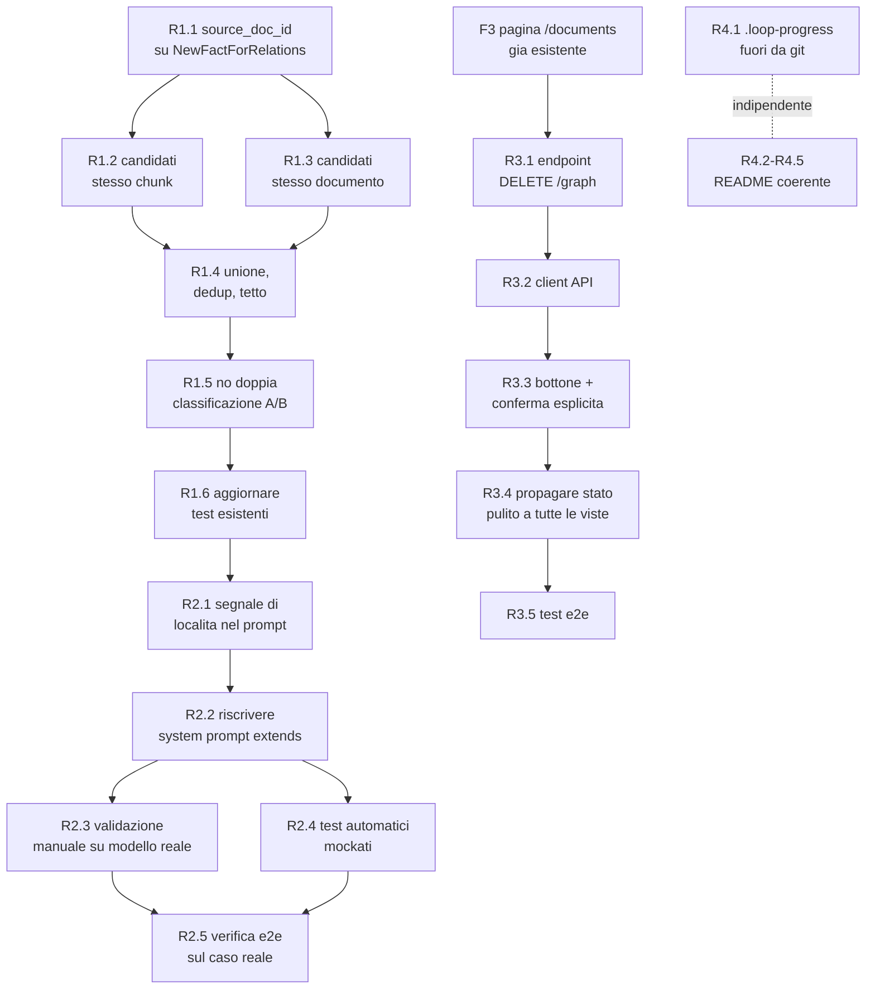

# Piano Implementativo — Coerenza documento/chunk nella rilevazione relazioni

> Fonti di verità: [`milestone1.md`](./milestone1.md), [`milestone1-tech-spec.md`](./milestone1-tech-spec.md), e per lo stile [`milestone1-implementation-plan.md`](./milestone1-implementation-plan.md)/[`milestone1-fixes-plan.md`](./milestone1-fixes-plan.md), di cui questo documento riprende esattamente il formato (Epic → task con Rif/Dipende da/Stima/Descrizione/Dettagli implementativi/DoD, Acceptance Criteria per Epic).
>
> Copre i due stadi discussi in chat per correggere il gap diagnosticato: fatti nati dallo stesso chunk/documento risultano oggi **isolati fra loro** nel grafo (nessun arco orizzontale), perché la rilevazione relazioni cerca candidati solo per similarità di embedding globale, senza alcun segnale di coerenza documentale. **Stadio 3 (coreference/entity resolution — il vero `derives`) resta esplicitamente fuori scope**, come confermato: non è materia di questo piano, è materia dell'Overlay Metagraph rimandato da `milestone1.md` §0.
>
> Include inoltre un terzo Epic (R3), indipendente dai primi due: un pulsante di reset completo della knowledge base nella pagina Documenti — utile come funzionalità reale e come strumento indispensabile per verificare a mano R1/R2 partendo da uno stato pulito, senza l'inquinamento di ingest precedenti.
>
> E un quarto Epic (R4), di manutenzione pura: il README ha accumulato disallineamenti rispetto allo stato reale del repo (nuova pagina Documenti, cronologia query, citazioni strutturate, variabili d'ambiente aggiunte nei fix precedenti) e va riportato a specchio del progetto attuale; inoltre `.loop-progress.md` — un artefatto di sessione, non un documento di progetto — va escluso da git in modo permanente, non gestito manualmente ad ogni commit.
>
> Il seguito di questa diagnosi (priorità ai marcatori temporali nel testo per `replaces`, prudenza quando non ce ne sono, limiti della KB nel README) è pianificato in un documento separato: [`milestone1-temporal-reasoning-plan.md`](./milestone1-temporal-reasoning-plan.md).

---

## 0. Come leggere questo piano

- **Epic**: uno dei due stadi, `R1` (chi viene confrontato) e `R2` (come viene giudicato). Ogni Epic ha un'**Acceptance Criteria** verificabile come sistema.
- **Task**: `R<epic>.<n>`, con Rif al codice reale, Dipende da, Stima (**S** = ore, **M** = 1 giorno circa), Descrizione, Dettagli implementativi, Definition of Done.
- **Ordine**: R1 prima di R2 — non ha senso raffinare *come* il classificatore giudica una coppia se quella coppia non arriva nemmeno a essere proposta. Dentro R1, i task 1→5 non sono intercambiabili: R1.1 è un prerequisito puro (dato mancante), R1.5 (anti-doppia-classificazione) ha senso solo dopo che R1.2–R1.4 hanno reso i candidati più numerosi.



**Nota sui costi (vale per tutto il piano):** allargare il pool di candidati aumenta il numero di chiamate LLM di classificazione per ciclo di dreaming. R1.4 (tetto massimo) e R1.5 (niente doppie classificazioni) sono i due meccanismi che tengono il costo sotto controllo — non sono ottimizzazioni opzionali, sono parte della Definition of Done di R1.

---

## EPIC R1 — Candidati di relazione con coerenza documento/chunk

**Track:** BE · **Dipende da:** — · **Obiettivo:** un fatto nato dallo stesso chunk/documento di un altro deve avere sempre una possibilità reale di essere confrontato con lui nella rilevazione relazioni — non solo se casualmente rientra nel top-k di similarità globale.

### Acceptance Criteria dell'Epic
- [x] Un fatto N ha come candidati, oltre al top-k per similarità globale (comportamento attuale, invariato), tutti i fatti correnti che condividono almeno un chunk sorgente con N — entro un tetto massimo per contenere il costo.
- [x] Un fatto N ha come candidati anche i fatti correnti dello stesso `source_doc_id` non già coperti dagli insiemi precedenti — entro un tetto massimo.
- [x] I fatti storici (`is_latest=false`) restano esclusi dai candidati in ogni caso, in tutte e tre le fonti — nessuna regressione sul test esistente `test_historical_fact_not_in_candidates`.
- [x] Nello stesso ciclo di dreaming, la coppia (A, B) non viene mai classificata due volte in direzioni opposte.
- [x] Verifica manuale: un documento che produce più fatti dallo stesso chunk, dopo un ciclo di dreaming, mostra archi orizzontali fra almeno alcuni di essi — non più tutti isolati come oggi.

### Task

#### R1.1 — Portare `source_doc_id` nei fatti nuovi/consolidati (prerequisito)
- **Rif:** `backend/app/pipeline/dreaming.py` (`NewFactForRelations`) · **Dipende da:** — · **Stima:** S
- **Descrizione:** oggi `NewFactForRelations` non porta il documento di origine del fatto — serve per poter interrogare "altri fatti dello stesso documento" in R1.3.
- **Dettagli implementativi:** aggiungere `source_doc_id: str = ""` al dataclass. Popolarlo nei tre punti di costruzione: `_add_facts_as_individual_candidates` (il valore è già disponibile da `_load_fact`, oggi semplicemente non viene propagato); `_write_abstraction` e `_write_cleaned_fact` (entrambe calcolano già `source_doc_id` localmente per la scrittura del nodo, va solo attaccato anche all'oggetto `NewFactForRelations` restituito).
- **Definition of Done:**
  - [x] Unit test: costruzione di `NewFactForRelations` con `source_doc_id` popolato correttamente in tutti e tre i percorsi.
  - [x] Nessuna modifica richiesta ai test di integrazione esistenti (campo additivo, non breaking).

#### R1.2 — Query di candidati "stesso chunk"
- **Rif:** `backend/app/pipeline/relations.py` (`find_candidates`) · **Dipende da:** R1.1 · **Stima:** M
- **Descrizione:** recuperare i fatti correnti che condividono almeno un chunk sorgente con N — il segnale di coerenza più forte disponibile, sfrutta il legame di provenienza `DERIVED_FROM` senza confonderlo con una relazione tipizzata (resta un filtro di retrieval, non diventa un arco `EXTENDS`/`DERIVES` automatico).
- **Dettagli implementativi:**
  ```cypher
  MATCH (n:Fact {id: $n_id})-[:DERIVED_FROM]->(:Chunk)<-[:DERIVED_FROM]-(candidate:Fact)
  WHERE candidate.is_latest = true AND candidate.id <> $n_id
  RETURN DISTINCT candidate.id AS id, candidate.text AS text
  LIMIT $chunk_limit
  ```
  `chunk_limit` costante interna del modulo (`MAX_CHUNK_LOCAL_CANDIDATES = 8`) — soglia di sicurezza sul costo, non una scelta di prodotto esposta via env. Un fatto senza alcun `DERIVED_FROM` (es. un'astrazione, se `ENABLE_DERIVES` venisse riattivato in futuro) restituisce semplicemente zero righe, nessun errore.
- **Definition of Done:**
  - [x] Test integrazione: 5 fatti creati con lo stesso chunk sorgente ma embedding reciprocamente ortogonali (nessuna chance di comparire nel top-k globale) → tutti e 5 si trovano l'un l'altro come candidati.
  - [x] Test integrazione: un fatto senza `DERIVED_FROM` (creato senza provenienza) non causa eccezioni, restituisce lista vuota da questa fonte.

#### R1.3 — Query di candidati "stesso documento"
- **Rif:** `relations.py` (`find_candidates`) · **Dipende da:** R1.1 · **Stima:** S
- **Descrizione:** segnale più debole del chunk ma comunque rilevante — copre i casi in cui un documento è stato spezzato in più chunk (§5.1) e due fatti collegati semanticamente finiscono su chunk diversi.
- **Dettagli implementativi:**
  ```cypher
  MATCH (candidate:Fact)
  WHERE candidate.is_latest = true AND candidate.id <> $n_id
    AND candidate.source_doc_id = $doc_id
  RETURN candidate.id AS id, candidate.text AS text
  LIMIT $doc_limit
  ```
  `doc_limit` costante interna (`MAX_DOC_LOCAL_CANDIDATES = 8`). Se `doc_id` è vuoto/assente, la query va saltata a monte (in Python), non eseguita con un filtro su stringa vuota che matcherebbe in modo indesiderato fatti senza `source_doc_id`.
- **Definition of Done:**
  - [x] Test integrazione: 2 fatti con lo stesso `source_doc_id` ma chunk diversi ed embedding non simili → si trovano comunque candidati a vicenda.
  - [x] Test: `doc_id` vuoto → questa fonte non produce candidati, nessun falso positivo.

#### R1.4 — Unione, deduplica e tetto complessivo dei candidati
- **Rif:** `relations.py` (`find_candidates`, `Candidate`) · **Dipende da:** R1.2, R1.3 · **Stima:** M
- **Descrizione:** le tre fonti (similarità globale — esistente, invariata; stesso chunk; stesso documento) vanno unite in un'unica lista senza duplicati, con un tetto complessivo per non far esplodere il numero di chiamate LLM per fatto — determinante per il rischio di costo segnalato in §0.
- **Dettagli implementativi:** `find_candidates` esegue le tre query, unisce i risultati in un dict indicizzato per `id`. `Candidate` diventa `Candidate(id: str, text: str, score: float | None, via: Literal["embedding","chunk","doc"])` — se lo stesso id emerge da più fonti, vince la fonte più "forte" nell'ordine `embedding > chunk > doc` (per il campo `via`, usato poi in R2.1) mantenendo comunque lo score reale se disponibile. Tetto complessivo `MAX_TOTAL_CANDIDATES = 20`: in caso di sforamento, si tronca nell'ordine embedding → chunk → doc (si perdono per ultimi i segnali più deboli).
- **Definition of Done:**
  - [x] Unit test: stesso id trovato sia per similarità sia per chunk-locality → una sola entry nel risultato, con `via="embedding"` e score reale preservato.
  - [x] Unit test: input che supera `MAX_TOTAL_CANDIDATES` viene troncato nell'ordine di priorità atteso (verificato esplicitamente contando quali `via` sopravvivono).

#### R1.5 — Evitare la doppia classificazione A↔B nello stesso ciclo
- **Rif:** `dreaming.py` (`run_dreaming_pipeline`, `_process_relation_detection`) · **Dipende da:** R1.4 · **Stima:** M
- **Descrizione:** con più candidati per fatto (dopo R1.2–R1.4), il caso concreto e frequente è che A trovi B come candidato (stesso chunk) e, quando arriva il turno di B come "fatto nuovo" nello stesso ciclo, B trovi A — due chiamate LLM sulla stessa coppia in direzioni opposte, con rischio di esiti incoerenti fra le due (es. "A extends B" da un lato, "none" dall'altro).
- **Dettagli implementativi:** un `set[frozenset[str]]` (`classified_pairs`) inizializzato una volta per l'intera esecuzione di `run_dreaming_pipeline`, passato per riferimento a `_process_relation_detection`. Prima di chiamare `classify_relation(new_fact.text, candidate.text)`: se `frozenset({new_fact.fact_id, candidate.id})` è già in `classified_pairs`, salta la coppia (nessuna chiamata LLM, nessun evento); altrimenti procede e aggiunge la coppia all'insieme **dopo** la classificazione, a prescindere dall'esito (incluso `none` — anche un "non c'è relazione" già deciso non va richiesto una seconda volta in direzione opposta).
- **Definition of Done:**
  - [x] Test integrazione: due fatti A e B candidati reciproci (stesso chunk) entrambi processati come "nuovi" nello stesso ciclo → `classify_relation` mockata viene chiamata **una sola volta** per la coppia (verificato contando le invocazioni del mock), non due.

#### R1.6 — Aggiornare i test esistenti impattati
- **Rif:** `backend/tests/test_dreaming_integration.py` · **Dipende da:** R1.1–R1.5 · **Stima:** S
- **Descrizione:** la firma/comportamento di `find_candidates` cambia — i test che vi si appoggiano, direttamente o indirettamente, vanno rivisti.
- **Dettagli implementativi:** rieseguire l'intera suite di integrazione dreaming. In particolare, `test_historical_fact_not_in_candidates` deve restare verde **senza modifiche concettuali**: `is_latest=true` è un filtro comune a tutte e tre le query introdotte, quindi un fatto storico resta escluso qualunque sia la fonte del candidato.
- **Definition of Done:**
  - [x] `pytest tests/test_dreaming_integration.py` interamente verde.

---

## EPIC R2 — Ampliare la classificazione `extends` per coerenza narrativa/documentale

**Track:** BE · **Dipende da:** R1 (serve che i candidati "giusti" arrivino al classificatore prima di poter migliorare come li giudica) · **Obiettivo:** dare al classificatore una possibilità reale di riconoscere come `extends` due fatti che fanno parte dello stesso episodio/documento anche quando non sono un dettaglio complementare stretto sullo stesso attributo — senza allargare `replaces` (resta un test di contraddizione, indipendente dalla provenienza) né svuotare `none` di significato.

### Acceptance Criteria dell'Epic
- [x] Il prompt di classificazione riceve un segnale esplicito quando i due fatti condividono chunk/documento (da R1.4's `via`), e ne tiene conto nel giudizio senza che diventi un verdetto automatico.
- [x] Un set di coppie di validazione manuale (almeno: 2 che devono restare `none` — genuinamente scorrelate anche se nello stesso documento; 2 che devono diventare `extends` sotto la definizione allargata; 2 che devono restare `replaces` per contraddizione netta) produce l'esito atteso contro il modello reale, non solo mockato.
- [x] `replaces` non è mai influenzato dal segnale di località — la contraddizione resta un giudizio sul contenuto, non sulla provenienza.

### Task

#### R2.1 — Aggiungere il segnale di località al prompt di classificazione
- **Rif:** `relations.py` (`build_relation_prompt`, `classify_relation`) · **Dipende da:** R1 (serve il campo `via` prodotto in R1.4) · **Stima:** S
- **Descrizione:** il classificatore oggi vede solo il testo dei due fatti, isolato da ogni contesto di provenienza — dargli il segnale "vengono dallo stesso passaggio/documento" gli permette di considerare la coerenza narrativa come informazione esplicita, non come inferenza nascosta nel retrieval.
- **Dettagli implementativi:**
  ```python
  def build_relation_prompt(
      n_text: str, v_text: str, *, same_chunk: bool = False, same_doc: bool = False
  ) -> tuple[str, str]:
      ...
  ```
  Se `same_chunk` è vero, aggiungere alla user prompt una riga: *"Nota: i due fatti provengono dallo stesso passaggio di testo."* Se solo `same_doc` (e non `same_chunk`), *"Nota: i due fatti provengono dallo stesso documento."* Se nessuno dei due, nessuna riga aggiuntiva — comportamento testualmente identico a oggi, per non introdurre regressioni sui casi puramente globali. `classify_relation` propaga i flag, derivati dal campo `via` del `Candidate` (`via == "chunk"` → `same_chunk=True`; `via == "doc"` → `same_doc=True`; `via == "embedding"` → nessuno dei due, anche se per coincidenza il candidato è pure dello stesso documento — la nota va data solo quando è **quella** la fonte per cui il candidato è stato proposto, per restare onesti su cosa ha guidato la scelta).
- **Definition of Done:**
  - [x] Unit test prompt builder: con `same_chunk=True` la nota compare nel testo; con `same_doc=True` (e `same_chunk=False`) compare l'altra nota; senza flag, testo identico al prompt pre-modifica.

#### R2.2 — Riscrivere il system prompt: allargare `extends` a "stesso episodio/situazione coerente"
- **Rif:** `relations.py` (`SYSTEM_PROMPT`) · **Dipende da:** R2.1 · **Stima:** M
- **Descrizione:** la definizione attuale di `extends` ("dettagli complementari sullo stesso soggetto/attributo") è corretta nella sostanza ma troppo stretta per riconoscere due frammenti dello stesso episodio narrativo come complementari fra loro — va allargata esplicitamente, lasciando **intatto** il test di non-contraddizione che definisce `replaces`.
- **Dettagli implementativi:** nuova formulazione della sezione `extends`, che espande "stesso soggetto" a "stessa situazione/episodio complessivo (non necessariamente lo stesso attributo specifico), purché il fatto nuovo non contraddica né renda superfluo quello esistente". Includere nel prompt due esempi minimi di ancoraggio: (a) due frasi che descrivono momenti diversi dello stesso evento narrativo → `extends`; (b) due frasi su argomenti scorrelati, anche se tecnicamente nello stesso documento → `none`. La sezione `replaces` resta testualmente invariata rispetto a oggi.
- **Definition of Done:**
  - [x] Unit test: il nuovo `SYSTEM_PROMPT` contiene la sezione `extends` riscritta con i due esempi; la sezione `replaces` è byte-per-byte quella precedente (diff mirato, non una riscrittura complessiva del prompt).

#### R2.3 — Set di validazione manuale contro il modello reale
- **Rif:** nuovo `backend/scripts/validate_relation_prompt.py` · **Dipende da:** R2.2 · **Stima:** M
- **Descrizione:** una modifica di prompt non è verificabile solo con unit test mockati (quelli confermano che il testo del prompt sia costruito correttamente, non che il modello si comporti come voluto) — serve un passaggio di validazione empirica esplicito prima di considerare il fix "fatto", con la consapevolezza che potrebbe servire più di un giro.
- **Dettagli implementativi:** script standalone (richiede `OPENAI_API_KEY` reale, non entra in CI) che chiama `classify_relation` su un set fisso di 6–8 coppie scritte a mano, rappresentative dei tre esiti attesi — incluso almeno un caso ricalcato sulle frasi della favola del Sole e del Vento che ha originato la diagnosi. Stampa, per ciascuna coppia, esito atteso vs ottenuto.
- **Definition of Done:**
  - [x] Eseguito manualmente, tutti gli esiti attesi confermati. Uno scostamento non è un fallimento del task ma un segnale per tornare a R2.2 e rifinire ulteriormente il prompt — l'iterazione è prevista, non un imprevisto.

#### R2.4 — Test automatici di non-regressione (mockati)
- **Rif:** `backend/tests/test_relation_prompt.py` (o file equivalente esistente) · **Dipende da:** R2.1, R2.2 · **Stima:** S
- **Descrizione:** fissare in CI tutto ciò che è automatizzabile — costruzione del prompt e propagazione dei flag — lasciando il giudizio semantico vero e proprio al gate manuale di R2.3.
- **Dettagli implementativi:** unit test sul prompt builder con le tre combinazioni (`same_chunk`, `same_doc`, nessuno dei due); test di integrazione dreaming con `classify_relation` mockata che verifica come vengono determinati e passati i flag `same_chunk`/`same_doc` in base al campo `via` del candidato prodotto in R1.4.
- **Definition of Done:**
  - [x] Suite verde.

#### R2.5 — Verifica end-to-end sul caso reale che ha innescato la diagnosi
- **Rif:** verifica manuale (non un test automatico) · **Dipende da:** R1, R2.1–R2.4 · **Stima:** S
- **Descrizione:** chiudere il cerchio sul caso concreto osservato — 18 fatti isolati collegati solo al chunk.
- **Dettagli implementativi:** rifare un ciclo ingest + dream sullo stesso tipo di documento (una breve narrazione che produce diversi fatti "episode" dallo stesso chunk) e verificare nel Graph Explorer che almeno alcuni dei fatti risultino ora collegati fra loro via `EXTENDS` — non più tutti isolati.
- **Definition of Done:**
  - [x] Verifica visiva positiva, allegata come nota/screenshot alla chiusura dell'Epic.

---

## EPIC R3 — Reset completo della knowledge base (pulsante nella pagina Documenti)

**Track:** BE → FE · **Dipende da:** `F3` del [piano fix](./milestone1-fixes-plan.md) (pagina `/documents` già esistente) — **indipendente da R1/R2**, può essere fatto in qualsiasi momento, anche in parallelo · **Obiettivo:** un unico pulsante che cancella l'intero grafo (tutti i `Chunk`, `Fact` e le relazioni fra loro, cronologia query inclusa) e riporta la knowledge base a uno stato vuoto — sia come funzionalità reale sia come strumento di lavoro per ripetere i test manuali di R2.3/R2.5 senza l'inquinamento di ingest precedenti.

### Acceptance Criteria dell'Epic
- [x] Un solo endpoint backend cancella tutto — nodi e relazioni di ogni tipo — mantenendo intatti schema/constraint/indici (nessun bisogno di ri-bootstrap dopo il reset).
- [x] L'azione è irreversibile e distruttiva: la UI richiede una conferma esplicita in due passi (bottone → dialog di conferma), non un solo click accidentale.
- [x] Dopo il reset, tutte le viste (Graph Explorer, pagina Documenti, cronologia query) riflettono lo stato vuoto senza richiedere un refresh manuale né un ricaricamento della pagina del browser.
- [x] Nessuno stato residuo incoerente dopo il reset (es. una voce di cronologia query che punta a un fatto ormai inesistente).

### Task

#### R3.1 — Endpoint backend di reset completo
- **Rif:** `backend/app/api/graph.py` (nuovo handler sullo stesso router di `GET /graph`) · **Dipende da:** — · **Stima:** S
- **Descrizione:** un solo comando che azzera il contenuto del grafo lasciando lo schema intatto — la stessa Cypher già usata per pulire il DB tra un test e l'altro (`neo4j_ready` fixture in `test_dreaming_integration.py`) diventa un'operazione di prodotto, esposta via API.
- **Dettagli implementativi:** `DELETE /graph` → esegue `MATCH (n) DETACH DELETE n` in un'unica sessione. **Sincrono**, non un job in background: a differenza di ingest/dreaming non ha senso tracciarlo con `job_id`/SSE, l'operazione è una singola query e ritorna appena completata. Risposta `{"deleted": true}`. Decisione esplicita: il reset è **totale**, non selettivo per label — rimuove `Chunk`, `Fact` e `QueryLog` (se F4 è già implementata) in un colpo solo, coerente con "elimina il grafo e tutto il contenuto ingestito". `DETACH DELETE` tocca solo i dati, non gli oggetti di schema (constraint/vector index restano intatti automaticamente — nessuna chiamata a `apply_schema` necessaria dopo).
- **Definition of Done:**
  - [x] Test integrazione: DB popolato con chunk, fatti, relazioni `UPDATES`/`EXTENDS` e (se disponibile) `QueryLog` → dopo `DELETE /graph` tutti i conteggi sono zero.
  - [x] `SHOW CONSTRAINTS`/`SHOW INDEXES` invariati rispetto a prima del reset (verifica che lo schema sopravviva).

#### R3.2 — Frontend: client API
- **Rif:** `frontend/lib/api-client.ts` · **Dipende da:** R3.1 · **Stima:** S
- **Descrizione:** esporre la chiamata al nuovo endpoint seguendo le convenzioni già in uso nel client.
- **Dettagli implementativi:** `resetKnowledgeBase(): Promise<void>` con lo stesso pattern di `request<T>()` usato da tutte le altre funzioni del client.
- **Definition of Done:**
  - [x] `tsc --noEmit` pulito.

#### R3.3 — Frontend: bottone con conferma esplicita nella pagina Documenti
- **Rif:** `frontend/components/DocumentsPage.tsx` · **Dipende da:** R3.2 · **Stima:** M
- **Descrizione:** il pulsante richiesto — ma un'azione distruttiva e irreversibile non può essere un solo click accidentale.
- **Dettagli implementativi:** bottone "Elimina tutto" (stile distintivo/destructive, distinto dagli altri controlli della pagina) che apre un `Dialog` (dipendenza `@radix-ui/react-dialog` già presente) con testo esplicito — *"Questa azione cancella l'intero grafo e tutti i documenti ingeriti. Non è reversibile."* — e un secondo bottone di conferma **dentro** il dialog: il primo click apre solo il dialog, non esegue nulla. Stato di caricamento durante la chiamata; messaggio di errore visibile se la chiamata fallisce.
- **Definition of Done:**
  - [x] Verifica manuale: il click iniziale sul bottone non cancella nulla da solo; solo la conferma nel dialog esegue la chiamata; chiudere/annullare il dialog non ha alcun effetto sui dati.

#### R3.4 — Propagare lo stato pulito a tutte le viste
- **Rif:** `frontend/lib/store.ts`, `GraphExplorer.tsx`, `DocumentsPage.tsx`, pannello cronologia query (F4) · **Dipende da:** R3.3 · **Stima:** S
- **Descrizione:** dopo un reset riuscito nessuna vista deve mostrare dati residui. A differenza di ingest/dreaming (F3.5, guidato dall'evento `pipeline_complete`), questa non è un'operazione in background: l'aggiornamento va fatto esplicitamente lato client alla risposta della chiamata, non tramite lo stream SSE.
- **Dettagli implementativi:** alla risposta riuscita di `resetKnowledgeBase()`: `setGraph([], [])`, `clearPipelineEvents()`, `clearHighlight()`, `setSelectedFactId(null)` sullo store; la pagina Documenti ricarica la propria lista (risulterà vuota); se la cronologia query (F4) è montata, va svuotata esplicitamente anch'essa — evita che per un istante restino visibili voci che, se selezionate, produrrebbero un 404 verso `GET /queries/{id}`.
- **Definition of Done:**
  - [x] Verifica manuale: dopo un reset confermato, Graph Explorer mostra "nessun fatto", pagina Documenti mostra lista vuota, cronologia query vuota — tutto senza ricaricare la pagina del browser.

#### R3.5 — Test end-to-end
- **Rif:** `backend/tests/`, verifica manuale frontend · **Dipende da:** R3.1–R3.4 · **Stima:** S
- **Descrizione:** chiudere l'Epic con una verifica che copre l'intero percorso, dati reali inclusi.
- **Dettagli implementativi:** test backend che ingerisce un documento, fa girare il dreaming, esegue una query (popolando anche `QueryLog` se F4 è già stata implementata), poi chiama `DELETE /graph` e verifica che ogni conteggio (chunk, fact, query log, relazioni di ogni tipo) sia zero. Verifica manuale del flusso completo in UI: bottone → conferma → stato vuoto ovunque.
- **Definition of Done:**
  - [x] Suite verde; verifica manuale positiva.

---

## EPIC R4 — Igiene repo: README coerente con lo stato attuale, `.loop-progress` sempre escluso da git

**Track:** DevOps/docs · **Dipende da:** — · **Indipendente da R1/R2/R3** — attività di manutenzione documentale, non una feature. **Obiettivo:** chi legge il README vede esattamente cosa esiste davvero nel repo oggi (non cosa era vero a fine E10, né cosa è solo pianificato in F1-F4/R1-R3); `.loop-progress.md` smette di comparire come diff spurio ad ogni commit.

### Acceptance Criteria dell'Epic
- [x] Il README riflette esattamente le funzionalità realmente presenti nel repo alla data della modifica (pagina Documenti, cronologia query, citazioni strutturate, `CORS_ORIGINS`, `ENABLE_DERIVES`) — non descrive come esistente nulla che sia solo pianificato in un documento di piano.
- [x] Il README linka tutti i documenti di piano esistenti in `milestone1/`, non solo il primo.
- [x] `.loop-progress.md` non compare più come file tracciato da git, qualunque modifica locale subisca.
- [x] La sezione "Progresso" distingue esplicitamente completato / in corso / pianificato, invece di fermarsi a "E0–E10 completate" come se coincidesse con l'intero stato del progetto.

### Task

#### R4.1 — Rimuovere `.loop-progress.md` dal tracking git e ignorarlo in modo permanente
- **Rif:** `.gitignore` (root) · **Dipende da:** — · **Stima:** S
- **Descrizione:** il file è oggi tracciato da git pur essendo un artefatto di sessione (progress tracker di un tool di automazione, non un documento di progetto) — ogni sua modifica o cancellazione locale genera un diff da gestire manualmente ad ogni commit, come già osservato più volte in questa sessione.
- **Dettagli implementativi:** aggiungere a `.gitignore` (root) `.loop-progress.md`, più `.loop_progress*` come variante difensiva nel caso lo stesso meccanismo produca in futuro un nome file leggermente diverso. Eseguire `git rm --cached .loop-progress.md` per fermare il tracking di un file già presente nella history, senza cancellarlo dal filesystem locale — chi lo usa per il proprio flusso di lavoro lo mantiene, semplicemente non finisce più nei commit.
- **Definition of Done:**
  - [x] `git status` non mostra mai `.loop-progress.md`, qualunque sia il suo contenuto locale.
  - [x] `git check-ignore -v .loop-progress.md` conferma che è ignorato.

#### R4.2 — Aggiornare i link alla documentazione
- **Rif:** `README.md`, sezione "Documentazione" · **Dipende da:** — · **Stima:** S
- **Descrizione:** il README linka solo il piano E0–E10 originale — i due piani successivi (fix e relation-detection) non sono raggiungibili da lì.
- **Dettagli implementativi:** aggiungere alla lista puntata i link a `milestone1/milestone1-fixes-plan.md` e `milestone1/milestone1-relation-detection-plan.md`, con una riga di descrizione breve ciascuno, stesso stile degli altri link già presenti.
- **Definition of Done:**
  - [x] Tutti i documenti presenti in `milestone1/` sono raggiungibili dal README.

#### R4.3 — Aggiornare il ciclo d'uso in UI (la pagina Documenti ha sostituito la barra eventi per l'ingest)
- **Rif:** `README.md`, sezione "Avvio consigliato — tutto lo stack" · **Dipende da:** — · **Stima:** S
- **Descrizione:** il README descrive ancora "Ingest documento dalla barra eventi" — da quando F3 ha spostato il form di ingest sulla pagina dedicata `/documents`, quell'istruzione non corrisponde più a dove si trova davvero il controllo in UI.
- **Dettagli implementativi:** riscrivere il ciclo tipico: *1. Vai su `/documents`, ingerisci un documento (doc_id + testo); 2. Osserva il Pipeline Monitor sulla dashboard principale (`/`) — resta aggiornato anche se hai lanciato l'azione da un'altra pagina; 3. **Dream** per consolidamento/relazioni (da `/documents`); 4. Esplora il grafo (si aggiorna da solo a fine pipeline); interroga dal Query Panel, richiama query precedenti dalla cronologia a tendina.* Verificare la formulazione esatta contro il comportamento reale dei componenti (`DocumentsPage.tsx`, `AppShell.tsx`) al momento della stesura, non a memoria — se nel frattempo qualche dettaglio è cambiato ulteriormente, il README deve seguire il codice, non viceversa.
- **Definition of Done:**
  - [x] Un utente che segue il README passo-passo non trova nessuna istruzione che punta a un controllo non più presente nel punto indicato.

#### R4.4 — Documentare le variabili d'ambiente mancanti
- **Rif:** `README.md`, sezione "Note operative" · **Dipende da:** — · **Stima:** S
- **Descrizione:** `CORS_ORIGINS` non compare mai nel README (solo in `.env.example`) — chi legge solo il README non saprebbe perché esiste né quando cambiarla.
- **Dettagli implementativi:** nuova riga nelle Note operative: *"**CORS**: `CORS_ORIGINS` (default `http://localhost:3000`) elenca le origini browser autorizzate a chiamare l'API — va estesa (valori separati da virgola) se il frontend gira su un host/porta diversa."* Verifica incrociata riga per riga fra ogni campo di `Settings` (`backend/app/core/config.py`) e le Note operative del README, per non lasciarne indietro altre già introdotte nei fix precedenti.
- **Definition of Done:**
  - [x] Ogni variabile d'ambiente non auto-esplicativa definita in `Settings` ha una riga di spiegazione nel README.

#### R4.5 — Sezione "Progresso" onesta: completato vs pianificato
- **Rif:** `README.md`, sezione "Progresso Milestone 1" · **Dipende da:** R4.2 · **Stima:** M
- **Descrizione:** la tabella oggi si ferma a "E0–E10 completate" — non dice nulla sui fix successivi, alcuni già implementati (F1–F4) e altri solo pianificati (R1–R3). Chi legge non ha modo di distinguere "esiste e funziona" da "è nel piano ma non ancora scritto".
- **Dettagli implementativi:** aggiungere sotto la tabella E0–E10 esistente due nuove tabelle — una per `F1`–`F4` (piano fix), una per `R1`–`R4` (questo piano) — con stato reale (`completata` / `in corso` / `pianificata`) verificato **contro il codice effettivamente presente nel repo** al momento della stesura, non contro le checkbox del piano stesso (che potrebbero non essere aggiornate).
- **Definition of Done:**
  - [x] Ogni riga delle nuove tabelle corrisponde a uno stato verificato nel codice (es. "F1 completata" solo se `cited_fact_ids` esiste davvero in `query_engine.py`), non a una supposizione basata sulle checkbox del piano.

---

## Riepilogo dipendenze critiche (per non ambiguità)

- **R1.1 blocca tutto il resto**: senza `source_doc_id` propagato su `NewFactForRelations`, R1.3 non ha un `doc_id` da interrogare — è un prerequisito da un rigo che va fatto per primo, non un dettaglio rimandabile.
- **R1.5 non è un'ottimizzazione facoltativa**: senza il tracking delle coppie già classificate, R1.2+R1.3 da soli possono più che raddoppiare le chiamate LLM per ciclo di dreaming (ogni coppia locale rischia di essere chiesta due volte, in entrambe le direzioni) — è parte della Definition of Done di R1, non un miglioramento futuro.
- **R2 non parte prima che R1 sia interamente verde**: R2.1 usa direttamente il campo `via` prodotto in R1.4 — costruire il segnale di località nel prompt sopra un retrieval dei candidati ancora incompleto produrrebbe flag `same_chunk`/`same_doc` costruiti su dati parziali.
- **R2.3 è un gate manuale, non automatizzabile in CI**: il criterio di successo di questo Epic dipende dal comportamento reale del modello su un prompt riscritto — nessun unit test mockato può sostituirlo, e uno scostamento in R2.3 è normale, non un errore da correggere "una volta sola" prima di procedere.
- **Stadio 3 (coreference/entity resolution, il `derives` "vero") resta fuori scope**, come confermato — questo piano non lo tocca. Quando verrà ripreso, andrà trattato come un'estensione separata (vicina all'Overlay Metagraph), non come una naturale prosecuzione di R2.
- **R3 è indipendente da R1/R2** e dipende solo da F3 (pagina Documenti già esistente): può essere implementato prima, dopo o in parallelo — non c'è nessun vincolo tecnico che lo leghi alla rilevazione relazioni, oltre alla comodità pratica di usarlo per ripetere i test manuali di R2.3/R2.5 da uno stato pulito.
- **R3.3 (conferma esplicita) non è negoziabile**: `DELETE /graph` è irreversibile e non selettivo — un bottone senza dialog di conferma è un difetto di sicurezza dei dati dell'utente, non un dettaglio di UX rimandabile.
- **R4 è indipendente da tutto il resto** e può essere fatto in qualunque momento — anzi, R4.1 (`.loop-progress.md` fuori da git) conviene farlo per primo fra tutti i task di questo documento, a prescindere dall'ordine degli altri Epic, perché è a costo pressoché zero e toglie subito un fastidio ricorrente dai commit futuri.
- **R4.5 dipende dallo stato reale del codice al momento in cui viene eseguito, non da questo piano**: se R1/R2/R3 vengono implementati parzialmente o in ordine diverso da come sono scritti qui, la tabella di progresso nel README deve riflettere cosa è *davvero* nel repo, non l'elenco dei task di questo documento.