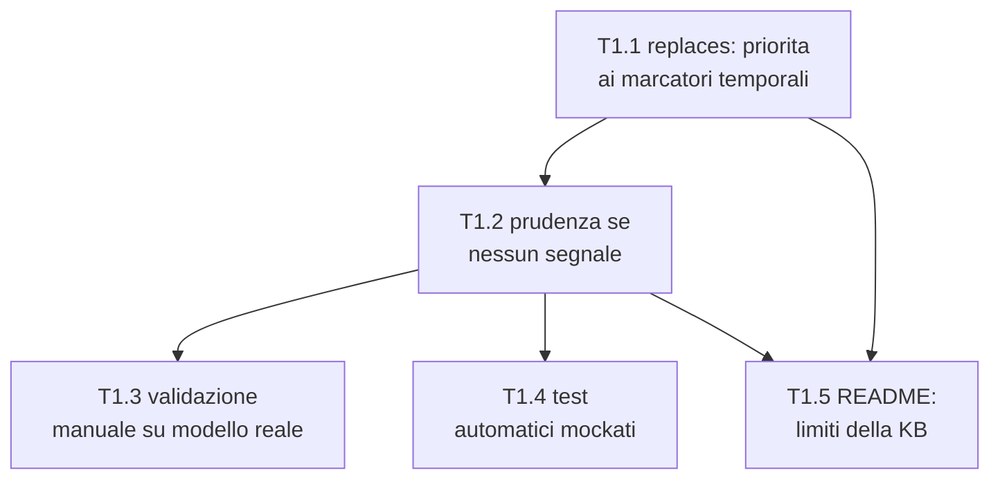

# Piano Implementativo — Ragionamento temporale in `replaces` e limiti della KB nel README

> Fonti di verità: [`milestone1.md`](./milestone1.md), [`milestone1-tech-spec.md`](./milestone1-tech-spec.md), e per lo stile [`milestone1-implementation-plan.md`](./milestone1-implementation-plan.md)/[`milestone1-fixes-plan.md`](./milestone1-fixes-plan.md)/[`milestone1-relation-detection-plan.md`](./milestone1-relation-detection-plan.md), di cui questo documento riprende esattamente il formato (Epic → task con Rif/Dipende da/Stima/Descrizione/Dettagli implementativi/DoD, Acceptance Criteria per Epic).
>
> Origine: un test reale su una breve storia, dopo l'implementazione di R1/R2 (piano relation-detection). Diagnosi verificata nel codice: `replaces` (l'esito che genera `UPDATES`, §5 di `milestone1.md`) non ha mai usato timestamp — `created_at` è scritto e mai riletto in `relations.py`/`dreaming.py`. L'unico segnale disponibile al classificatore è l'etichetta `FATTO NUOVO`/`FATTO ESISTENTE`, assegnata dall'ordine (arbitrario) con cui la pipeline itera i fatti — non un dato temporale. Il modello può leggere quell'etichetta come priorità cronologica anche quando non lo è, producendo `UPDATES` spuri fra fatti che sono in realtà due momenti sequenziali della stessa narrazione, non una correzione di un fatto sbagliato.
>
> **Fuori scope, per esplicita richiesta:** il secondo punto della diagnosi originale (l'ordine dei turni in un transcript multi-turno come segnale temporale legittimo) — richiederebbe tracciare la struttura conversazionale in ingestione, una feature che oggi non esiste, non una correzione di prompt. Non è materia di questo piano.

---

## 0. Come leggere questo piano

- **Epic**: `T1`, un solo blocco di lavoro coeso (la correzione è concettualmente un'unica cosa: dare al classificatore un segnale temporale vero e un comportamento prudente in sua assenza, poi dirlo chiaramente a chi usa l'app). Ha un'**Acceptance Criteria** verificabile come sistema.
- **Task**: `T1.<n>`, con Rif al codice reale, Dipende da, Stima (**S** = ore, **M** = 1 giorno circa), Descrizione, Dettagli implementativi, Definition of Done.
- **Ordine**: T1.1 → T1.2 sono sequenziali (stesso blocco di prompt, la prudenza si aggiunge sopra la ricerca dei marcatori, non al suo posto). T1.3/T1.4 dipendono da entrambi (validano il prompt finale, non una versione intermedia). T1.5 (README) dipende da T1.1/T1.2 — descrive il comportamento *dopo* il fix, non prima.

**Nota di dipendenza esterna:** T1.1 modifica `_REPLACES_SECTION` in `relations.py` — lo stesso `SYSTEM_PROMPT` che R2.2 (piano relation-detection) ha già esteso per `extends`. Va eseguito **dopo** che R2.2 è completata, per evitare di lavorare su due versioni del prompt in parallelo e doverle poi riconciliare a mano.

---

## EPIC T1 — `replaces` guidato da marcatori temporali nel contenuto, non dall'ordine di elaborazione

**Track:** BE → docs · **Dipende da:** `R2.2` del [piano relation-detection](./milestone1-relation-detection-plan.md) (stesso `SYSTEM_PROMPT`) · **Obiettivo:** il classificatore decide `replaces` solo quando trova nel testo un segnale temporale reale; in sua assenza non forza una decisione, e chi usa l'app sa in anticipo cosa aspettarsi.

### Acceptance Criteria dell'Epic
- [x] Il prompt di classificazione istruisce esplicitamente il modello a cercare marcatori temporali nel contenuto (date, espressioni come "ora", "da allora", "fino al", "ho appena iniziato") come base per `replaces` — non l'ordine di presentazione dei due fatti.
- [x] Il prompt chiarisce esplicitamente che le etichette `FATTO NUOVO`/`FATTO ESISTENTE` indicano solo un ruolo tecnico nel confronto, non un'affermazione di priorità cronologica.
- [x] In assenza di un segnale temporale genuino in entrambi i fatti, il modello non forza `replaces` — confermato con un set di validazione manuale contro il modello reale, non solo con unit test.
- [x] Nessuna regressione sui casi con contraddizione esplicita e segnale temporale chiaro — quelli devono restare `replaces` esattamente come prima.
- [x] Il README spiega, in termini leggibili da chi non conosce il codice, quali formati sono ingeribili e quali segnali temporali il sistema riesce a cogliere nel testo e quali no.

### Task

#### T1.1 — Riscrivere la sezione `replaces`: priorità ai marcatori temporali nel contenuto
- **Rif:** `backend/app/pipeline/relations.py` (`SYSTEM_PROMPT`, `_REPLACES_SECTION`) · **Dipende da:** R2.2 (piano relation-detection) · **Stima:** M
- **Descrizione:** oggi `_REPLACES_SECTION` dice solo *"un'informazione più recente annulla la precedente"*, senza mai dire come si stabilisce la recency — il modello non ha altro segnale se non l'ordine con cui i due fatti gli vengono presentati (`FATTO NUOVO`/`FATTO ESISTENTE`), che è un artefatto di iterazione della pipeline (`run_dreaming_pipeline`), non un dato temporale.
- **Dettagli implementativi:** riscrivere `_REPLACES_SECTION` per includere esplicitamente:
  1. la richiesta di cercare marcatori temporali nel testo di **entrambi** i fatti (date assolute, espressioni relative come "ora", "da allora", "fino al", "ho appena iniziato", "il mese scorso") come base primaria per stabilire quale dei due descrive lo stato più recente;
  2. una frase che disinnesca l'implicazione di priorità delle etichette: *"Le etichette FATTO NUOVO/FATTO ESISTENTE indicano solo quale dei due stai valutando ora — non implicano da sole che uno sia temporalmente precedente all'altro."*

  Rimuovere il commento "byte-stable" sopra `_REPLACES_SECTION` nel codice sorgente: la premessa che lo giustificava (la sezione non necessitava revisione, R2 lavorava solo su `extends`) è quella smentita da questa diagnosi.
- **Definition of Done:**
  - [x] Unit test: il nuovo testo contiene esplicitamente l'istruzione di cercare marcatori temporali e la frase di disinnesco delle etichette.
  - [x] Unit test: `build_relation_prompt` continua a sostituire correttamente i placeholder (nessuna regressione sul builder).

#### T1.2 — Regola di prudenza: nessun segnale temporale genuino → non forzare `replaces`
- **Rif:** `relations.py` (`SYSTEM_PROMPT`) · **Dipende da:** T1.1 · **Stima:** S
- **Descrizione:** anche con il segnale giusto da cercare, serve un'istruzione esplicita su cosa fare quando non si trova — altrimenti il modello, dovendo comunque scegliere fra le tre opzioni, può propendere per `replaces` per inerzia.
- **Dettagli implementativi:** aggiungere alla sezione `replaces` (o come nota conclusiva del prompt, prima della richiesta di risposta strutturata): *"Se nessuno dei due fatti contiene un marcatore temporale esplicito che stabilisca quale dei due descrive lo stato più recente, non scegliere `replaces` sulla sola base dell'ordine di presentazione — valuta invece se i due fatti possono coesistere (`extends`) o se non c'è relazione significativa (`none`). Dichiarare erroneamente `replaces` nasconde un fatto vero: è un errore peggiore di non dichiarare nulla."*
- **Definition of Done:**
  - [x] Unit test: il testo della regola di prudenza compare nel prompt, inclusa la motivazione esplicita (asimmetria di rischio), non solo l'istruzione nuda.

#### T1.3 — Validazione manuale contro il modello reale
- **Rif:** `backend/scripts/validate_relation_prompt.py` (esteso da R2.3 del piano relation-detection, stesso script) · **Dipende da:** T1.1, T1.2 · **Stima:** M
- **Descrizione:** come per R2.3, una riscrittura di prompt non è verificabile solo con unit test sul testo — serve un passaggio empirico contro il modello reale.
- **Dettagli implementativi:** estendere il set di coppie di validazione con almeno:
  - 2 coppie con marcatore temporale esplicito e contraddizione genuina → devono restare `replaces` (verifica di non-regressione);
  - 2 coppie senza alcun segnale temporale ma testualmente diverse — due momenti sequenziali della stessa narrazione, senza contraddizione → devono diventare `extends`, non più `replaces`;
  - 1 coppia deliberatamente ambigua/borderline, per osservare qualitativamente come il modello giustifica la scelta.
- **Definition of Done:**
  - [x] Eseguito manualmente, tutti gli esiti attesi confermati — incluso che i casi di contraddizione genuina con marcatore esplicito restano `replaces` (nessuna regressione). Uno scostamento riporta a T1.1/T1.2 per un'ulteriore rifinitura, non è un fallimento del task.

#### T1.4 — Test automatici di non regressione (mockati)
- **Rif:** `backend/tests/test_relation_prompt.py` (o file equivalente) · **Dipende da:** T1.1, T1.2 · **Stima:** S
- **Descrizione:** fissare in CI la costruzione del prompt, lasciando il giudizio semantico vero e proprio al gate manuale di T1.3.
- **Dettagli implementativi:** unit test che verificano la presenza dei due nuovi blocchi di testo (ricerca marcatori temporali, regola di prudenza) nel `SYSTEM_PROMPT`. Nessuna modifica necessaria ai test che mockano `classify_relation` a livello di `dreaming.py`: la firma della funzione non cambia, solo il contenuto testuale del prompt.
- **Definition of Done:**
  - [x] Suite verde.

#### T1.5 — README: limiti della knowledge base — formati ingeribili e cosa il sistema coglie a livello di lettura
- **Rif:** `README.md`, nuova sezione "Limiti della knowledge base" · **Dipende da:** T1.1, T1.2 (descrive il comportamento *dopo* il fix, non prima) · **Stima:** S
- **Descrizione:** chi usa l'app deve sapere, prima di ingerire qualcosa, cosa il sistema può ragionevolmente cogliere e cosa no — non scoprirlo a posteriori guardando un grafo confuso, come è successo in questa sessione.
- **Dettagli implementativi:** nuova sezione nel README con due parti:
  1. **Formati ingeribili**: solo testo semplice o Markdown, passati come stringa (`doc_id` + `text` a `POST /documents`) — nessun parsing di PDF, DOCX, HTML, immagini o altri formati strutturati; il Markdown è trattato come testo semplice nel chunking (nessuna interpretazione di intestazioni/liste come struttura).
  2. **Cosa il sistema riesce a cogliere nel testo** (dopo T1.1/T1.2): marcatori temporali **espliciti** nel contenuto (date, "ora", "da allora", "il mese scorso") — sono il segnale primario per riconoscere quale fatto è più recente. **Cosa non riesce a cogliere**: l'ordine di lettura/posizione nel documento non è un segnale temporale valido, e il sistema è stato istruito a non trattarlo come tale; la struttura di una conversazione multi-turno (chi ha detto cosa e in quale ordine) non è riconosciuta — un transcript viene letto come prosa continua, non come sequenza di turni datati (limite esplicito, corrisponde al secondo punto della diagnosi originale, volutamente fuori scope da questo fix).
- **Definition of Done:**
  - [x] Verifica di lettura: un utente che legge solo questa sezione sa, prima di ingerire un documento, se il tipo di contenuto che ha in mente (es. un transcript di chat) rientra nei casi ben gestiti o in quelli con limiti noti.

---

## Riepilogo dipendenze critiche (per non ambiguità)

- **T1.1 va eseguita dopo R2.2** (piano relation-detection), non prima e non in parallelo: entrambe toccano lo stesso `SYSTEM_PROMPT` in `relations.py` — farle insieme rischia una riconciliazione manuale di due modifiche sullo stesso testo.
- **T1.3 è un gate manuale, non automatizzabile in CI** — stesso principio di R2.3: il criterio di successo dipende dal comportamento reale del modello su un prompt riscritto, nessun unit test mockato può sostituirlo, e un'iterazione in più su T1.1/T1.2 è normale, non un errore.
- **T1.5 dipende dal fix effettivo, non lo precede**: descrivere nel README un comportamento "prudente" prima che il prompt lo implementi davvero produrrebbe documentazione falsa fin dal primo commit.
- **Il secondo punto della diagnosi (ordine dei turni conversazionali) resta esplicitamente fuori da questo piano** — se ripreso in futuro, richiede prima una feature di ingestione consapevole della struttura conversazionale, non un altro giro di prompt-tuning su `relations.py`.
