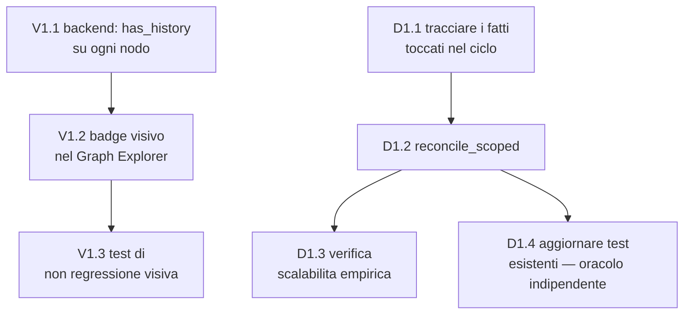

# Piano Implementativo — Visibilità degli `UPDATES` nel Graph Explorer e riconciliazione scoped

> Fonti di verità: [`milestone1.md`](./milestone1.md), [`milestone1-tech-spec.md`](./milestone1-tech-spec.md), e per lo stile [`milestone1-implementation-plan.md`](./milestone1-implementation-plan.md)/[`milestone1-fixes-plan.md`](./milestone1-fixes-plan.md)/[`milestone1-relation-detection-plan.md`](./milestone1-relation-detection-plan.md)/[`milestone1-temporal-reasoning-plan.md`](./milestone1-temporal-reasoning-plan.md), di cui questo documento riprende esattamente il formato (Epic → task con Rif/Dipende da/Stima/Descrizione/Dettagli implementativi/DoD, Acceptance Criteria per Epic).
>
> Origine: due problemi emersi da un test reale end-to-end (ingest → dream → query → ingest di un secondo documento contraddittorio → verifica nel Graph Explorer). Entrambi confermati con dati reali, non solo diagnosticati a codice:
>
> **V1 — Gli `UPDATES` esistono ma sono invisibili.** Un ciclo di dreaming ha prodotto correttamente 3 archi `UPDATES` (verificato con query diretta a Neo4j), ma nessuno era visibile nel Graph Explorer con "solo correnti" attivo — perché un arco `UPDATES` per definizione punta a un fatto `is_latest=false`, e la vista corrente esclude quel nodo. L'arco esiste, l'utente non ha modo di saperlo.
>
> **D1 — Il ciclo di dreaming rifà una riconciliazione globale ad ogni add.** `reconcile()` esegue oggi `MATCH (f:Fact)` su **tutta** la KB alla fine di ogni ciclo, indipendentemente da quanto piccolo sia stato l'ultimo ingest — l'unico punto della pipeline che non scala con la dimensione dell'ultimo contributo ma con la dimensione totale della base dati. Il resto della pipeline (grouping, consolidamento, rilevazione relazioni) è già correttamente incrementale, verificato nel codice prima di scrivere questo piano.

---

## 0. Come leggere questo piano

- **Epic**: `V1` (visibilità in UI) e `D1` (riconciliazione scoped) — **indipendenti fra loro**, toccano file completamente diversi, possono procedere in qualunque ordine o in parallelo.
- **Task**: `V1.<n>` / `D1.<n>`, con Rif al codice reale, Dipende da, Stima (**S** = ore, **M** = 1 giorno circa), Descrizione, Dettagli implementativi, Definition of Done.



---

## EPIC V1 — Rendere visibili gli `UPDATES` anche nella vista "solo correnti"

**Track:** BE → FE · **Dipende da:** — · **Obiettivo:** un fatto corrente che ha sostituito una versione precedente lo mostra, anche quando il nodo storico non è renderizzato — come indizio sul nodo, non riportando lo storico in vista di default.

### Acceptance Criteria dell'Epic
- [x] Ogni nodo del Graph Explorer che ha almeno un arco `UPDATES` uscente (cioè ha sostituito qualcosa) è visivamente distinguibile, anche con "solo correnti" attivo.
- [x] Il badge/indizio non richiede di disattivare "solo correnti" per essere visto — è la scoperta del fatto che *esiste* uno storico ad essere risolta, non la visualizzazione dello storico stesso (quello lo fa già il doppio click, E7.4).
- [x] Nessuna regressione sulla codifica visiva esistente (colore per `type`, opacità per storico, pulse) — il nuovo indizio si aggiunge, non sostituisce nulla.

### Task

#### V1.1 — Backend: aggiungere l'indicatore "ha storico" a ogni nodo di `GET /graph`
- **Rif:** `backend/app/pipeline/query_engine.py` (`get_graph`, `GRAPH_NODES_CYPHER`), `backend/app/api/schemas.py` (`GraphNode`) · **Dipende da:** — · **Stima:** M
- **Descrizione:** il Graph Explorer deve sapere, per ogni nodo mostrato, se quel fatto ha sostituito qualcosa — senza dover caricare né mostrare il nodo storico stesso.
- **Dettagli implementativi:** aggiungere `has_history: bool` alle `properties` di ogni `GraphNode` restituito da `get_graph`. Approccio a due query per evitare N sotto-query per nodo: dopo aver raccolto gli `ids` dei nodi da restituire (come già avviene per `GRAPH_RELS_CYPHER`), una query aggiuntiva:
  ```cypher
  MATCH (f:Fact)-[:UPDATES]->()
  WHERE f.id IN $ids
  RETURN DISTINCT f.id AS id
  ```
  Il set di id risultante marca `has_history=true` sui nodi corrispondenti in Python prima di costruire la risposta; tutti gli altri restano `false`. Nessuna modifica a `GraphNode`/`GraphResponse` a livello di forma — solo un campo aggiuntivo dentro `properties`, coerente con come `is_latest`/`type` sono già esposti oggi.
- **Definition of Done:**
  - [x] Test integrazione: un fatto con un arco `UPDATES` uscente compare con `has_history=true`; un fatto senza, con `has_history=false`.
  - [x] Test integrazione: la query aggiuntiva non altera il numero né l'ordine dei nodi/relazioni già restituiti da `get_graph` — è puramente additiva.

#### V1.2 — Frontend: badge visivo sui nodi con storico
- **Rif:** `frontend/lib/graph-encoding.ts` (`encodeNode`), `frontend/components/GraphExplorer.tsx` (legenda) · **Dipende da:** V1.1 · **Stima:** M
- **Descrizione:** tradurre `has_history=true` in un segnale visivo scopribile senza dover sapere in anticipo quale nodo cliccare due volte.
- **Dettagli implementativi:** in `encodeNode`, quando `node.properties?.has_history === true`, aggiungere un indicatore distinto dagli altri stati già codificati (storico/selezione/pulse) — es. un piccolo badge/icona sovrapposta (NVL supporta overlay o proprietà aggiuntive sul nodo; se il rendering diretto di un'icona non è pratico, un bordo di colore dedicato o un pattern distinguibile funziona altrettanto, purché non si sovrapponga visivamente al significato di "storico" già usato per `is_latest=false`). Aggiungere una voce alla legenda del Graph Explorer (footer, dove già compaiono i colori per `type` e relazione): *"● = questo fatto ha sostituito una versione precedente — doppio click per vedere la catena."* Nessuna nuova interazione da costruire: il doppio click che rivela lo storico esiste già (E7.4, `onNodeDoubleClick` → `getFactHistory`) — questo task risolve solo la scopribilità, non l'interazione.
- **Definition of Done:**
  - [x] Verifica manuale: un fatto noto per aver sostituito qualcosa (es. dal test reale di questa sessione) mostra il badge con "solo correnti" attivo; doppio click su di esso rivela la catena come già avviene oggi.
  - [x] Verifica manuale: un fatto senza storico non mostra il badge.

#### V1.3 — Test di non regressione della codifica visiva
- **Rif:** `frontend/docs/e7-visual-encoding-checklist.md`, `frontend/lib/graph-visual-fixture.ts` (esistenti da E7.2/F2.3) · **Dipende da:** V1.2 · **Stima:** S
- **Descrizione:** il nuovo indizio non deve alterare silenziosamente la codifica visiva già validata due volte in precedenza (E7.2, F2.3).
- **Dettagli implementativi:** estendere la fixture esistente con almeno un caso `has_history=true` incrociato con le combinazioni già coperte (type, storico, pulse, selezione); ripercorrere la checklist con questo caso aggiunto.
- **Definition of Done:**
  - [x] Checklist ripercorsa senza scostamenti rispetto alla codifica preesistente.

---

## EPIC D1 — Riconciliazione scoped: costo proporzionale al ciclo, non alla KB intera

**Track:** BE · **Dipende da:** — · **Obiettivo:** ogni ciclo di dreaming resta limitato al lavoro di quel ciclo — la riconciliazione automatica di fine ciclo passa da una scansione globale (`MATCH (f:Fact)` su tutta la KB) a una scansione ristretta ai soli fatti toccati in quel ciclo. La riconciliazione globale (`POST /reconcile`) resta invariata e disponibile su richiesta come strumento di verifica/riparazione profonda.

### Acceptance Criteria dell'Epic
- [x] Ogni ciclo di dreaming esegue una riconciliazione automatica limitata ai soli fatti effettivamente valutati in quel ciclo (sorgente o bersaglio di un `apply_relation`), mai un `MATCH (f:Fact)` su tutta la KB.
- [x] Il contratto esistente resta identico nella forma: stesso evento SSE `drift_check`, stesso campo `DreamingStats.drift_count` — cambia solo l'ampiezza della query sottostante, non l'interfaccia osservabile.
- [x] `POST /reconcile` (riconciliazione globale) resta invariato, disponibile per verifiche/riparazioni complete su richiesta.
- [x] Verificato empiricamente: ingerendo un piccolo documento in una KB con molti fatti preesistenti, la riconciliazione automatica di quel ciclo tocca un numero di righe proporzionale al nuovo materiale, non al totale della KB.
- [x] Nessuna regressione sui criteri di accettazione `is_latest` di `milestone1.md` §8 — la verifica di quei criteri deve continuare a usare la riconciliazione **piena** come oracolo indipendente, non la versione scoped appena introdotta (altrimenti il test verifica la funzione con se stessa).

### Task

#### D1.1 — Tracciare i fatti toccati durante la rilevazione relazioni
- **Rif:** `backend/app/pipeline/dreaming.py` (`run_dreaming_pipeline`, `_process_relation_detection`) · **Dipende da:** — · **Stima:** S
- **Descrizione:** serve un elenco preciso di quali fatti sono stati effettivamente valutati in questo ciclo, per poter limitare la riconciliazione a loro soli.
- **Dettagli implementativi:** un `set[str]` (`touched_fact_ids`) inizializzato in `run_dreaming_pipeline` accanto a `classified_pairs` (già presente da R1.5), passato per riferimento a `_process_relation_detection`. Ad ogni chiamata di `relations.apply_relation(n_id=..., v_id=...)`, aggiungere **entrambi** gli id a `touched_fact_ids` — indipendentemente dall'esito (`replaces`/`extends`/`none`): non costa nulla in più e copre difensivamente il caso di un fatto valutato ma non modificato che avesse comunque un flag incoerente da uno stato precedente.
- **Definition of Done:**
  - [x] Unit test: dopo un ciclo con N candidati valutati per un fatto nuovo, `touched_fact_ids` contiene esattamente il fatto nuovo più tutti i candidati confrontati — non l'intera KB, non un sottoinsieme casuale.

#### D1.2 — Riconciliazione ristretta (`reconcile_scoped`)
- **Rif:** `backend/app/pipeline/reconcile.py` (nuova funzione), `dreaming.py` · **Dipende da:** D1.1 · **Stima:** M
- **Descrizione:** la funzione di riconciliazione esistente scansiona sempre l'intera label `Fact` — serve una variante che accetti un insieme di id e limiti la scansione a quelli, lasciando la funzione piena invariata per l'uso on-demand.
- **Dettagli implementativi:**
  ```python
  async def reconcile_scoped(fact_ids: list[str]) -> int:
      """Recompute is_latest only for the given facts (dreaming-cycle canary,
      bounded by this cycle's work). See reconcile() for the full-KB variant,
      used on-demand via POST /reconcile."""
      if not fact_ids:
          return 0
      ...
  ```
  Query Cypher:
  ```cypher
  MATCH (f:Fact) WHERE f.id IN $fact_ids
  WITH f, NOT EXISTS { ()-[:UPDATES]->(f) } AS correct
  WHERE f.is_latest <> correct
  SET f.is_latest = correct
  RETURN count(f) AS driftCount
  ```
  In `run_dreaming_pipeline`, sostituire la chiamata a `reconcile.reconcile()` con `reconcile.reconcile_scoped(list(touched_fact_ids))`. L'evento SSE `drift_check` e `DreamingStats.drift_count` restano identici nella forma — cambia solo l'ampiezza della query sottostante. La funzione `reconcile()` esistente (piena) **non viene toccata** e continua a servire `POST /reconcile` per verifiche globali su richiesta (debug, audit periodico, o dopo una futura funzione di cancellazione che rimuova archi esistenti — l'unico scenario in cui la riconciliazione scoped da sola non basterebbe, perché il touched-set di un ciclo di dreaming non include fatti toccati da un'operazione diversa dal dreaming stesso).
- **Definition of Done:**
  - [x] Test integrazione: un ciclo di dreaming con pochi fatti nuovi in una KB con molti fatti preesistenti esegue una riconciliazione che tocca solo i fatti attesi (verificabile contando le righe effettivamente processate, o con una query di verifica sul numero di nodi coinvolti).
  - [x] Test integrazione: `POST /reconcile` continua a funzionare come verifica globale indipendente, invariato nel comportamento.

#### D1.3 — Verifica di scalabilità empirica
- **Rif:** nuovo test o script manuale · **Dipende da:** D1.2 · **Stima:** S
- **Descrizione:** dimostrare concretamente che il fix risolve il problema originale osservato, non solo che il codice è cambiato.
- **Dettagli implementativi:** popolare la KB con un numero significativo di fatti preesistenti (es. un centinaio, via fixture di test), poi ingerire un documento piccolo e osservare che la riconciliazione automatica di quel ciclo tocca un numero di righe proporzionale al documento appena ingerito — non al totale preesistente. Confrontabile, come verifica di regressione concettuale, con il comportamento pre-fix sullo stesso scenario (che avrebbe toccato tutte le righe).
- **Definition of Done:**
  - [x] Numero di righe toccate dalla riconciliazione automatica di un ciclo indipendente (entro un margine ragionevole) dalla dimensione della KB preesistente.

#### D1.4 — Aggiornare i test esistenti impattati: l'oracolo di verifica resta la riconciliazione piena
- **Rif:** `backend/tests/test_dreaming_integration.py`, `backend/tests/test_acceptance_milestone1.py` · **Dipende da:** D1.1, D1.2 · **Stima:** S
- **Descrizione:** il criterio "la ricomputazione `is_latest` non cambia alcuna riga dopo un ciclo di dreaming" (`milestone1.md` §8) va verificato con uno strumento indipendente da quello appena usato internamente dal ciclo — altrimenti il test diventa una tautologia (la riconciliazione scoped che verifica se stessa).
- **Dettagli implementativi:** rivedere il test che copre quel criterio (es. `test_criterion_reconciliation_no_drift_after_dreaming` o nome equivalente) per assicurarsi che la sua asserzione finale chiami esplicitamente `reconcile.reconcile()` — la funzione piena, indipendente — dopo il ciclo di dreaming, non `reconcile_scoped`. È l'unico modo per cui il test resti un vero canarino esterno.
- **Definition of Done:**
  - [x] `test_acceptance_milestone1.py` interamente verde, con la verifica del criterio `is_latest` ancora basata sulla riconciliazione piena come oracolo indipendente dal meccanismo appena introdotto.

---

## Riepilogo dipendenze critiche (per non ambiguità)

- **V1 e D1 sono completamente indipendenti** — file diversi, nessuna dipendenza tecnica reciproca. Possono essere assegnati in parallelo o fatti in qualunque ordine.
- **D1.4 non è un dettaglio rimandabile**: senza di esso, il criterio di accettazione più delicato del milestone (§8 di `milestone1.md`, "la ricomputazione is_latest non cambia alcuna riga") smette silenziosamente di essere una verifica reale — verificherebbe che `reconcile_scoped` sia coerente con se stessa, non che l'invariante `is_latest` valga davvero sull'intero grafo.
- **`POST /reconcile` (piena) non va mai rimosso né sostituito con la versione scoped**: resta l'unico strumento capace di rilevare drift causato da qualcosa di diverso dal dreaming stesso (es. una futura funzione di cancellazione documento, discussa in precedenza, che rimuove archi esistenti) — la riconciliazione scoped di D1.2 per costruzione non può coprire quel caso, dato che il suo `touched_fact_ids` esiste solo per la durata di un ciclo di dreaming.
- **V1.2 dipende da V1.1 nella forma esatta del dato**: il badge deve leggere `properties.has_history`, non inventare un'euristica lato frontend (es. "questo nodo ha meno archi degli altri") — l'informazione deve arrivare già calcolata dal backend, dove la query è economica e certa.
